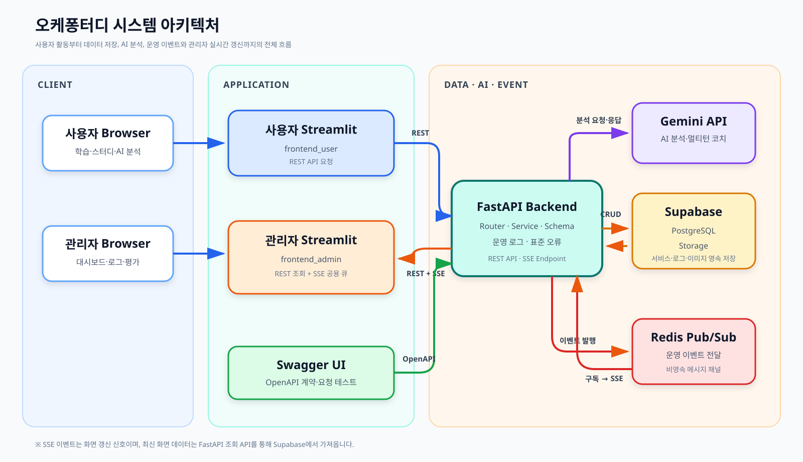

# 오케퐁터디

> 학습 기록과 스터디 활동을 AI 분석으로 연결하고, 운영 로그와 사용자 피드백을 통해 서비스 상태와 AI 품질을 관찰하는 스터디 관리 서비스


## 목차

1. [프로젝트 소개](#1-프로젝트-소개)
2. [프로젝트 목표와 핵심 기능](#2-프로젝트-목표와-핵심-기능)
3. [핵심 사용 시나리오](#3-핵심-사용-시나리오)
4. [시스템 아키텍처](#4-시스템-아키텍처)
5. [설계와 구현의 연결](#5-설계와-구현의-연결)
6. [핵심 기술 구현](#6-핵심-기술-구현)
7. [MVP에서 최종 구현까지](#7-mvp에서-최종-구현까지)
8. [테스트와 배포 검증](#8-테스트와-배포-검증)
9. [시연 시나리오](#9-시연-시나리오)
10. [로컬 실행 방법](#10-로컬-실행-방법)
11. [프로젝트 문서](#11-프로젝트-문서)

## 1. 프로젝트 소개

학습 기록과 스터디 활동은 메모, 메신저, 커뮤니티 등 여러 서비스에 분산되어 있습니다. 이로 인해 사용자는 자신의 학습 현황을 파악하기 어렵고, 적합한 스터디를 찾거나 꾸준히 운영하기도 어렵습니다.

오케퐁터디는 학습 기록, 스터디 탐색과 참여, AI 학습 분석을 하나의 서비스로 통합합니다. 사용자가 남긴 활동과 AI 평가를 운영 로그로 연결하여, 관리자가 서비스 상태와 AI 품질을 함께 관찰할 수 있도록 설계했습니다.

```text
학습 기록
→ 스터디 탐색과 참여
→ AI 학습 분석과 추가 질문
→ 사용자 피드백
→ 운영 로그와 관리자 모니터링
```

## 2. 프로젝트 목표와 핵심 기능

| 프로젝트 목표 | 구현 기능 |
| --- | --- |
| 백엔드·데이터베이스·UI 통합 | Streamlit–FastAPI–Supabase 연동 |
| 학습 및 스터디 관리 | 학습 기록 CRUD·통계, 스터디 생성·검색·참여 |
| AI 기반 학습 지원 | Gemini 학습 분석과 멀티턴 학습 코치 |
| 실시간 운영 관찰 | 운영 로그, Redis Pub/Sub, SSE 관리자 갱신 |
| 사용자 기반 품질 관리 | AI 평가 저장, 평균·분포·사용자 의견 조회 |

### 2.1 사용자 기능

- 회원가입·로그인·로그아웃
- 학습 기록 등록·조회·수정·삭제와 인증 이미지 업로드
- 과목별 및 누적 학습 통계
- 개인·그룹 스터디 생성·검색·수정·삭제·참여·탈퇴
- 누적 학습 기록 기반 AI 분석
- 최대 20개 메시지의 멀티턴 AI 학습 코치
- AI 분석 만족도와 의견 등록

### 2.2 관리자 기능

- 사용자·스터디·기능 이용 현황 대시보드
- 기능별 성공·실패·평균 응답 시간 확인
- 운영 로그 검색·필터링과 `trace_id` 기반 요청 추적
- Redis Pub/Sub과 SSE를 이용한 이벤트 기반 화면 갱신
- AI 평가 평균·점수 분포·사용자 의견 확인

## 3. 핵심 사용 시나리오

### 3.1 사용자 시나리오

1. 사용자는 학습 기록을 등록하고 과목별 학습 현황을 확인합니다.
2. 개인 또는 그룹 스터디를 생성하거나 원하는 스터디에 참여합니다.
3. 누적 학습 기록을 바탕으로 AI 학습 분석을 요청합니다.
4. 분석 결과에 추가 질문하고 만족도와 의견을 등록합니다.

### 3.2 관리자 시나리오

1. 관리자는 사용자·스터디·AI 요청 현황을 확인합니다.
2. SSE 이벤트를 통해 갱신된 대시보드와 운영 로그를 확인합니다.
3. 실패 로그를 필터링하고 `trace_id`로 요청 흐름을 추적합니다.
4. AI 평가의 평균·분포·사용자 의견을 확인합니다.

## 4. 시스템 아키텍처



| 구성 요소 | 역할 |
| --- | --- |
| 사용자·관리자 Streamlit | 역할에 맞는 화면과 사용자 상호작용 제공 |
| FastAPI | API 계약, 입력 검증, 비즈니스 로직과 운영 로그 처리 |
| Supabase PostgreSQL | 사용자·학습·스터디·대화·피드백·운영 로그 저장 |
| Supabase Storage | 학습 인증 이미지 저장 |
| Gemini | 학습 기록 분석과 멀티턴 코치 응답 생성 |
| Redis Pub/Sub | API에서 발생한 운영 이벤트를 프로세스 간 전달 |
| SSE | Redis 이벤트를 관리자 화면에 단방향으로 전달 |
| Swagger UI | OpenAPI 기반 API 계약 확인과 요청 테스트 |

Redis는 영속 데이터베이스로 사용하지 않습니다. API에서 발생한 운영 이벤트를 Pub/Sub 채널로 전달하고, SSE가 이를 구독하여 관리자 화면 갱신 신호로 사용합니다. 실제 서비스 데이터와 운영 로그는 Supabase에 저장합니다.

## 5. 설계와 구현의 연결

### 5.1 데이터베이스: 테이블 관계에서 기능으로

사용자, 학습 기록, 스터디, 참여 관계를 중심으로 MVP를 구성하고 AI 대화와 평가 기능을 확장했습니다.

```text
users
├─ study_records
├─ studies
├─ study_members
├─ chat_conversations
│  └─ chat_messages
└─ analysis_feedback

operation_logs → 주요 API의 실행 결과와 지연 시간 추적
```

| 테이블 | 연결되는 기능 |
| --- | --- |
| `study_records` | 학습 기록·통계와 AI 분석의 근거 데이터 |
| `studies`, `study_members` | 개인·그룹 스터디와 참여 관계 |
| `chat_conversations`, `chat_messages` | 멀티턴 대화와 최근 메시지 문맥 |
| `analysis_feedback` | 사용자·분석 기간별 AI 평가 |
| `operation_logs` | 기능별 성공·실패·지연 시간·`trace_id` 추적 |

[데이터베이스 MVP 설계서](docs/03_데이터베이스_설계서_MVP.md) · [데이터베이스 확장 설계서](docs/05-1_데이터베이스_설계서_확장.md)

### 5.2 API: 계약과 역할에서 기능으로

API는 화면과 데이터베이스 사이의 계약을 담당합니다. Router가 HTTP 요청과 응답을 처리하고, Service가 비즈니스 규칙과 외부 서비스 연동을 담당하도록 역할을 분리했습니다.

| API 영역 | 지원 기능 |
| --- | --- |
| Auth | 회원가입·로그인·로그아웃 |
| Records | 학습 기록 CRUD·통계·인증 이미지 |
| Studies | 스터디 생성·조회·수정·삭제·참여 |
| Analyses | AI 학습 분석 |
| Chat | 멀티턴 대화와 대화 이력 |
| Feedback | AI 분석 평가 저장·조회 |
| Admin | 운영 지표·로그·피드백 분석 |
| Events | 관리자 SSE 이벤트 스트림 |

주요 API는 공통 성공 형식과 표준 오류 응답을 사용하며, 운영 로그로 실행 결과를 추적합니다.

[API MVP 명세서](docs/03_API_명세서_MVP.md) · [API 확장 명세서](docs/05-2_API_명세서_확장.md)

### 5.3 화면: UI/UX 배치에서 기능으로

사용자 화면은 학습 활동 흐름에 집중하고, 관리자 화면은 운영 상태와 문제 분석에 집중하도록 분리했습니다.

- 사용자 화면: 홈, 학습 기록, 개인·그룹 스터디, AI 분석, 마이페이지
- 관리자 화면: 대시보드, 운영 로그, AI 평가
- 사용자 사이드바: 주요 기능 메뉴와 사용자 영역을 분리하고, 사용자 이름·역할 아래에 마이페이지 버튼과 로그아웃 버튼 배치
- 그룹 스터디: 참여 중인 그룹과 그룹 탐색을 구분한 별도 영역
- 자동 갱신: 그룹 스터디 목록은 120초, 관리자 화면은 SSE 큐를 최대 5초마다 확인
- 공통 UX: 로딩, 빈 상태, 오류 안내, 재시도

[화면 MVP 설계서](docs/03_화면_설계서_MVP.md) · [화면 확장 설계서](docs/05-3_화면_설계서_확장.md)

## 6. 핵심 기술 구현

### 6.1 운영 로그와 요청 추적

주요 API 요청의 기능명, 상태, 메시지, 처리 시간과 `trace_id`를 저장합니다. 관리자는 실패 로그를 필터링하고 같은 요청에서 발생한 문제를 추적할 수 있습니다.

### 6.2 Redis Pub/Sub과 SSE

```text
API에서 운영 이벤트 발생
→ Redis Pub/Sub 채널에 발행
→ FastAPI SSE 스트림이 이벤트 수신
→ 관리자 프론트엔드의 공용 큐에 저장
→ 활성 화면이 최대 5초마다 큐 확인
→ 이벤트가 있을 때만 관련 조회 API 재호출
```

이 구조는 관리자 화면의 지속적인 데이터 조회를 줄이면서 운영 변화를 반영합니다. SSE는 알림 신호를 전달하고, 화면에 표시할 최신 데이터는 관련 API를 다시 호출해 조회합니다.

### 6.3 AI 분석과 멀티턴 대화

- 누적 학습 기록을 Gemini에 전달해 학습 현황과 다음 목표 분석
- 최근 메시지를 문맥으로 사용하는 멀티턴 대화
- 대화별 메시지를 최대 20개로 관리
- Gemini 할당량 초과 등 외부 AI 오류를 표준 API 오류로 변환

### 6.4 AI 평가와 관리자 분석

사용자는 분석 결과에 점수와 의견을 등록할 수 있습니다. 동일 사용자와 분석 기간의 평가는 중복 생성하지 않고 갱신하며, 관리자는 평균 점수·점수 분포·사용자 의견을 확인합니다.

### 6.5 백엔드 성능 개선

- Supabase 클라이언트를 프로세스 내에서 재사용
- 그룹 스터디 목록의 반복 조회를 관련 데이터 3회 일괄 조회로 변경
- 외부 API 계약을 변경하지 않고 내부 연결·조회 비용 절감

## 7. MVP에서 최종 구현까지

| 단계 | 필요 또는 문제 | 기술적 결정 |
| --- | --- | --- |
| MVP | 기본 서비스 흐름 검증 | 학습 기록·스터디·AI 분석 구현 |
| 운영 확장 | 서비스 실행 상태 관찰 필요 | 운영 로그와 `trace_id` 도입 |
| 실시간성 | 관리자 화면의 반복 조회 개선 | Redis Pub/Sub과 SSE 도입 |
| AI 확장 | 후속 질문과 분석 평가 필요 | 멀티턴 대화와 피드백 구현 |
| UI 개선 | 기능 증가에 따른 탐색 복잡도 | 화면 분리·AI 두 탭·상태 UI 개선 |
| 성능 개선 | 반복 연결과 사용자 수 의존 조회 | 클라이언트 재사용·일괄 조회 |
| 안정화 | 확장 기능의 회귀 위험 | 테스트 보강과 배포 환경 검증 |

초기 `1~4번 계획서`에서 MVP를 설계·구현하고, `5번 계열 계획서`에서 SSE·멀티턴 AI·평가·화면 개선을 확장했습니다. 변경된 합의 사항은 확장 계획서를 현재 구현 기준으로 동기화했습니다.

[개발 계획서](docs/04_개발_계획서_MVP.md) · [확장 계획서](docs/05_SSE_멀티턴_AI_확장_계획서.md) · [구현과 계획 일치 분석](docs/etc/06_구현과_계획_일치_분석.md)

## 8. 테스트와 배포 검증

### 8.1 자동 테스트

```text
63 passed, 1 warning
```

- API 요청·응답 계약
- 서비스 비즈니스 규칙
- 표준 오류 처리
- AI 대화와 피드백
- SSE 이벤트
- Supabase 클라이언트 재사용
- 그룹 스터디 일괄 조회

경고 1건은 Starlette TestClient와 httpx의 호환성 deprecation 경고이며 테스트 실패는 아닙니다.

### 8.2 배포 검증

배포 환경에서 다음 핵심 기능의 동작을 검증했습니다.

| 검증 항목 | 상태 |
| --- | --- |
| 사용자 핵심 기능 | 배포 환경 검증 |
| AI 분석·멀티턴 대화 | 배포 환경 검증 |
| 피드백 저장·관리자 조회 | 배포 환경 검증 |
| 운영 로그 저장·필터링 | 배포 환경 검증 |
| Redis/SSE 관리자 갱신 | 배포 환경 검증 |
| 오류·빈 상태·재시도 | 배포 환경 검증 |

[테스트 체크리스트](docs/test_checklist.md)

## 9. 시연 시나리오

1. 사용자로 로그인해 학습 기록과 스터디 현황을 확인합니다.
2. 학습 기록을 추가하고 AI 분석을 요청합니다.
3. 분석 결과에 추가 질문하고 평가를 등록합니다.
4. 관리자 화면에서 갱신된 대시보드를 확인합니다.
5. 운영 로그에서 AI 요청과 처리 시간을 확인합니다.
6. `trace_id`와 오류 필터를 이용해 요청을 추적합니다.
7. AI 평가 화면에서 점수 분포와 사용자 의견을 확인합니다.

시연에서는 다음 전체 연결이 실제로 동작하는지 보여줍니다.

```text
UI 동작
→ API 계약
→ 데이터 저장
→ AI 처리
→ 운영 로그
→ Redis/SSE 갱신
→ 관리자 분석
```

## 10. 로컬 실행 방법

### 10.1 요구 환경

- Python 3.12
- Supabase 프로젝트와 `proof-images` Storage 버킷
- Gemini API 키
- Redis 인스턴스

### 10.2 백엔드

```powershell
cd backend
pip install -r requirements.txt
Copy-Item .env.example .env
uvicorn app.main:app --reload
```

- Swagger UI: <http://127.0.0.1:8000/docs>
- 상태 확인: <http://127.0.0.1:8000/health>

### 10.3 사용자 화면

```powershell
cd frontend_user
pip install -r requirements.txt
Copy-Item .env.example .env
streamlit run app.py
```

### 10.4 관리자 화면

```powershell
cd frontend_admin
pip install -r requirements.txt
Copy-Item .env.example .env
streamlit run app.py
```

### 10.5 프로젝트 구조

```text
.
├─ backend/          # FastAPI, Supabase, Gemini, Redis/SSE
├─ frontend_user/    # 사용자 Streamlit 애플리케이션
├─ frontend_admin/   # 관리자 Streamlit 애플리케이션
└─ docs/             # 계획서, DB·API·화면 설계서
```

데이터베이스 생성 순서와 환경 변수는 [백엔드 실행 안내](backend/README.md)를 참고합니다. `.env`와 서비스 역할 키는 Git에 커밋하지 않습니다.

## 11. 프로젝트 문서

| 순서 | 구분 | 문서 |
| --- | --- | --- |
| 1 | 문제와 사용 시나리오 | [01 문서](docs/01_문제와_사용_시나리오_정의.md) |
| 2 | 통합 아키텍처 | [02 문서](docs/02_통합_아키텍처_설계.md) |
| 3 | MVP 설계 | [DB](docs/03_데이터베이스_설계서_MVP.md) · [API](docs/03_API_명세서_MVP.md) · [화면](docs/03_화면_설계서_MVP.md) |
| 4 | MVP 개발 계획 | [04 문서](docs/04_개발_계획서_MVP.md) |
| 5 | 확장 설계 | [계획](docs/05_SSE_멀티턴_AI_확장_계획서.md) · [DB](docs/05-1_데이터베이스_설계서_확장.md) · [API](docs/05-2_API_명세서_확장.md) · [화면](docs/05-3_화면_설계서_확장.md) |
| 6 | 계획·구현 검증 | [06 문서](docs/etc/06_구현과_계획_일치_분석.md) |
| 발표용 통합 문서 | 최종 구현 요약 | [DB](docs/presentation/01_데이터베이스_설계_발표.md) · [API](docs/presentation/02_API_설계_발표.md) · [화면](docs/presentation/03_화면_설계_발표.md) · [구현 발전 과정](docs/presentation/04_구현_발전_과정_발표.md) |
| - | 테스트 | [테스트 체크리스트](docs/test_checklist.md) |
