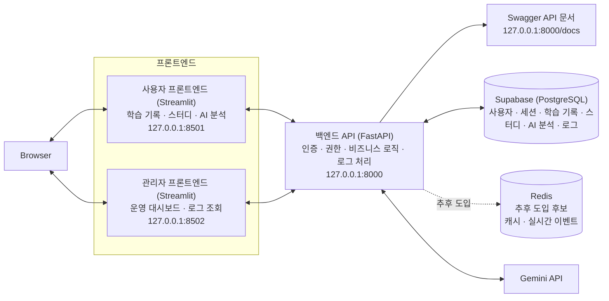

# 2단계｜통합 아키텍처 설계

## 목차

1. 설계 목표
2. 전체 구성과 기술 스택
3. 프론트엔드 분리와 권한 원칙
4. 주요 데이터 흐름
5. 실시간 반영 전략
6. 사용자 피드백 수집·활용 후보(팀 합의 필요)
7. 로그 설계 원칙
8. 보안·배포 및 환경변수 관리 원칙

## 1. 설계 목표

스터디 관리 웹 서비스의 사용자 기능과 관리자 대시보드를 분리된 Streamlit 프론트엔드로 제공하고, 하나의 FastAPI 백엔드·Supabase 데이터베이스·로그 수집 체계로 통합합니다. 사용자 서비스는 학습 기록·스터디 모집·AI 학습 분석을 제공하며, 관리자 서비스는 운영 지표와 로그를 조회·분석합니다.

### MVP와 확장 설계 기준

| 구분 | 현재 구현 기준 | 후속 확장 기준 |
| --- | --- | --- |
| 구현 기준 문서 | `03_데이터베이스_설계서_MVP.md`, `03_API_명세서_MVP.md` | `03_데이터베이스_설계서.md`와 확장 API |
| 데이터베이스 | `03_데이터베이스_설계서_MVP.md`의 5개 테이블 | `03_데이터베이스_설계서.md`의 상세 테이블과 규칙 |
| 사용자 식별 | Streamlit `session_state`의 `user_id`, `role` | FastAPI 서버 세션과 보안 쿠키 |
| AI 분석 | 결과를 현재 화면에 표시 | 분석 이력 저장·조회 |
| 인증 사진 | 학습 기록당 경로 1개 | 여러 사진 Storage 참조 |
| 로그 | 기본 성공·실패 로그 | 리소스·HTTP 상태·검색 결과를 포함한 상세 로그 |

아래 전체 구성도는 후속 확장을 포함한 목표 아키텍처입니다. 현재 MVP는 이 구조에서 Redis, 서버 세션, 분석 이력·피드백·멀티턴 후보 기능을 제외한 부분을 구현합니다.

## 2. 전체 구성과 기술 스택

### 2.1 컴포넌트별 역할

| 구성 요소 | 역할 |
| --- | --- |
| 사용자 프론트엔드 (Streamlit) | 회원·로그인, 학습 기록 등록·수정·삭제, 스터디 검색·생성·참여·탈퇴, 학습 통계와 AI 분석 결과를 제공합니다. AI 결과 평가는 팀 합의 시 추가합니다. |
| 관리자 프론트엔드 (Streamlit) | 사용자·스터디·기능 이용량 지표, AI 요청 성공률·오류율·응답 시간, 로그 목록과 오류 상세 조회를 제공합니다. |
| 백엔드 API (FastAPI) | 인증과 역할 기반 권한 제어, 사용자·스터디·학습 기록·AI 분석의 비즈니스 로직, 공통 로그 생성을 담당합니다. 피드백 기능은 팀 합의 시 추가합니다. |
| Supabase (PostgreSQL) | 사용자, 스터디, 참여 정보, 학습 기록, 운영 로그를 저장합니다. MVP의 AI 분석 결과는 화면에 바로 반환하고, 분석 이력·피드백 데이터는 확장 단계에서 저장합니다. |
| Redis (추후 도입 후보) | 애자일 방식의 후속 기능 후보입니다. 현재 MVP에는 포함하지 않으며, 추후 캐시와 실시간 이벤트 처리 필요성을 검토합니다. |
| Gemini API | 누적 학습 기록을 분석해 과목별 현황, 부족한 영역, 다음 학습 목표를 생성합니다. |
| Swagger | 백엔드 API의 엔드포인트, 요청·응답 모델, 인증·오류 응답을 개발·테스트용으로 제공합니다. |

## 3. 프론트엔드 분리와 권한 원칙

사용자용과 관리자용 프론트엔드는 별도 Streamlit 애플리케이션으로 배포·운영합니다. 두 프론트엔드는 동일한 FastAPI 백엔드를 사용하지만, API에서 역할(Role)에 따라 접근을 최종 통제합니다. 프론트엔드를 분리하더라도 관리자 권한 검증을 화면에서만 처리해서는 안 됩니다.

| 구분 | 사용자 프론트엔드 | 관리자 프론트엔드 |
| --- | --- | --- |
| 주요 대상 | 개인 사용자, 스터디 참여자·생성자 | 관리자 |
| 주요 화면 | 학습 기록, 통계, 스터디 검색·상세, AI 분석 | 운영 요약, 사용자·스터디 통계, 로그 검색·상세, AI 품질 지표 |
| 접근 권한 | 본인 기록과 참여·생성한 스터디 | 관리자 역할이 검증된 운영 데이터 |
| API 예시 | `/records`, `/studies`, `/analysis` | `/admin/dashboard`, `/admin/logs`, `/admin/metrics` |

## 4. 주요 데이터 흐름

### 1. MVP 사용자 식별 처리

1. 사용자는 Streamlit에서 로그인하고, 프론트엔드는 `st.session_state`에 `user_id`, `role`을 저장합니다.
2. 프론트엔드는 기능 API를 호출할 때 학습 기록·스터디·로그를 사용자와 연결하기 위한 `user_id`를 Query Parameter 또는 JSON 본문에 넣습니다.
3. MVP에서는 정상 입력을 가정하며, `user_id`는 인증 토큰이 아닌 데이터 연결용 식별값입니다.

### 2. 전체 확장: 서버 세션 인증 처리

1. 사용자는 사용자 프론트엔드 또는 관리자 프론트엔드에서 이메일과 비밀번호로 로그인 요청을 보냅니다.
2. FastAPI는 `users.password_hash`를 검증합니다.
3. 인증에 성공하면 FastAPI는 예측 불가능한 세션 ID를 발급하고, 세션 ID의 해시와 만료 시각을 Supabase의 `user_sessions` 테이블에 저장합니다.
4. 브라우저에는 세션 ID 원문을 `HttpOnly`, `Secure`, `SameSite` 속성이 적용된 쿠키로 전달합니다.
5. 이후 요청마다 FastAPI는 쿠키의 세션 ID를 검증해 사용자 식별자와 역할을 확인합니다. JWT는 사용하지 않습니다.

### 3. 사용자 기능 처리

1. 브라우저의 사용자 프론트엔드가 백엔드 API에 학습 기록, 스터디, AI 분석 요청을 전송합니다.
2. MVP 백엔드는 정상 입력을 가정하고 `user_id`로 데이터를 연결해 비즈니스 로직을 처리합니다. 서버 세션 도입 후에는 인증 정보와 사용자 역할을 검증합니다.
3. 영속 데이터는 Supabase에 저장하거나 조회합니다.
4. 처리 결과와 공통 로그를 기록합니다.
5. 사용자 프론트엔드는 정상 결과, 빈 데이터, 권한 오류, API 오류와 재시도 상태를 표시합니다.
6. 스터디 목록·상세처럼 다른 사용자의 변경을 확인해야 하는 화면은 주기적으로 최신 데이터를 조회해 갱신합니다.

### 4. AI 학습 분석 처리

1. 사용자가 누적 학습 기록을 기반으로 분석을 요청합니다.
2. 백엔드는 해당 사용자의 기록 접근 권한을 검증하고 분석에 필요한 데이터를 Supabase에서 조회합니다.
3. 백엔드는 Gemini API에 분석을 요청합니다.
4. MVP에서는 분석 결과를 사용자 화면에 바로 반환하고, 요청 시간·성공 여부·오류 코드·응답 시간만 운영 로그에 기록합니다. 확장 단계에서는 분석 결과·실패 정보를 Supabase의 분석 이력에 저장합니다.
5. 사용자에게 분석 결과를 표시합니다. 결과 평가 기능은 팀 합의 시 추가합니다.

### 5. 관리자 로그 조회

1. 백엔드는 학습 기록, 스터디, AI 분석, 로그인, 권한 오류, API 오류 이벤트마다 공통 로그를 생성합니다. 로그에는 기능 유형·관련 데이터 식별자·검색 결과 수·HTTP 상태 코드를 함께 기록합니다.
2. 로그는 Supabase에 저장합니다.
3. 관리자 프론트엔드는 주기적으로 API를 조회해 최신 로그와 운영 지표를 갱신합니다.
4. 관리자는 ERROR 로그를 필터링해 발생 시간, 사용자 식별자, 기능, 오류 코드와 상세 내용을 조회합니다.

## 5. 실시간 반영 전략

MVP에서는 WebSocket을 사용하지 않고, 프론트엔드가 FastAPI 조회 API를 일정 주기로 호출하는 **주기적 폴링** 방식으로 최신 데이터를 반영합니다. 사용자가 직접 등록·수정·참여·탈퇴를 수행한 경우에는 해당 요청의 응답을 받은 직후 관련 데이터를 다시 조회해 즉시 화면에 반영합니다.

| 대상 화면 | MVP 갱신 방식 | 권장 조회 주기 |
| --- | --- | --- |
| 학습 기록 등록·수정·삭제 | 요청 성공 후 즉시 재조회 | 사용자 이벤트 발생 시 |
| 스터디 목록·상세 | 최신 스터디 정보 조회 API를 주기적으로 호출 | 5~10초 |
| 관리자 운영 대시보드 | 최신 로그·지표 조회 API를 주기적으로 호출 | 3~5초 |

Streamlit에서는 전체 화면을 rerun하거나, 필요 시 특정 화면 영역만 rerun하여 해당 조회 API를 호출합니다. 프래그먼트 사용 여부는 구현 방식의 선택이며, 핵심은 정해진 주기에 FastAPI 조회 API를 호출하는 것입니다.

### 후속 도입 후보｜팀 합의 필요

사용자 수·로그량이 늘어나거나 더 빠른 갱신이 필요해질 경우, Redis를 이벤트 처리 보조 수단으로 도입하고 WebSocket 또는 Server-Sent Events(SSE) 방식으로 자동 갱신하는 방안을 검토합니다. 이는 현재 MVP의 확정 범위가 아닙니다.

## 6. 사용자 피드백 수집·활용 후보｜팀 합의 필요

> 아래 내용은 현재 확정된 요구사항이 아닙니다. AI 분석 결과에 대한 사용자 피드백을 수집·활용할지, 수집한다면 평가 방식과 운영 지표를 어떻게 정할지 팀이 합의한 뒤 반영 여부를 결정합니다.

### 후보 흐름

1. 사용자는 AI 분석 결과 화면에서 만족도 점수와 선택 의견을 등록합니다.
2. 사용자 프론트엔드는 FastAPI에 피드백을 전송합니다.
3. 백엔드는 해당 AI 분석 결과의 소유자 여부를 확인한 뒤 피드백을 Supabase에 저장합니다.
4. 피드백 등록의 성공·실패 결과를 공통 로그로 기록합니다.
5. 관리자 프론트엔드는 점수 분포, 의견 수, 낮은 평가의 분석 유형을 조회합니다.
6. 관리자는 피드백과 AI 요청 성공·실패 로그를 함께 확인해 Gemini 요청 방식과 서비스 개선 항목을 검토합니다.

### 후보 데이터

| 필드 | 설명 |
| --- | --- |
| `feedback_id` | 피드백 식별자 |
| `analysis_id` | 평가 대상 AI 분석 결과 식별자 |
| `user_id` | 작성자 식별자 |
| `score` | 만족도 점수(예: 1~5) |
| `comment` | 선택 의견 |
| `created_at` | 작성 시각 |

## 7. 로그 설계 원칙

| 필드 | 설명 |
| --- | --- |
| `timestamp` | 이벤트 발생 시각 |
| `user_id` | 요청 사용자 식별자 |
| `study_id` | 관련 스터디 식별자(해당 시) |
| `action` | 수행한 기능 또는 이벤트 유형 |
| `status` | 성공·실패 상태 |
| `resource_type` | 관련 데이터 유형. 예: `record`, `study`, `analysis`, `auth` |
| `resource_id` | 관련 학습 기록·스터디·AI 분석의 식별자 |
| `result_count` | 검색·조회 결과 수. `0`이면 결과 없음 |
| `http_status` | API 응답 HTTP 상태 코드 |
| `error_code` | 오류 코드(오류 발생 시) |
| `latency_ms` | 요청 처리 시간(ms) |
| `trace_id` | 하나의 요청 흐름을 추적하기 위한 식별자 |

로그에는 비밀번호, 인증 토큰, 인증 사진 원본, 상세 학습 내용 등 민감 정보를 저장하지 않습니다.

## 8. 보안·배포 및 환경변수 관리 원칙

- 사용자 프론트엔드와 관리자 프론트엔드는 Render에서 별도 서비스 또는 별도 경로로 배포합니다.
- FastAPI 백엔드도 Render에 배포하며, 사용자·관리자 프론트엔드는 이 백엔드 API를 호출합니다.
- 백엔드 주소, Supabase 연결 정보, Gemini API 키, 비밀번호 해싱 관련 설정은 Render 환경변수로 관리하며 소스 코드와 저장소에 직접 기록하지 않습니다.
- 사용자 비밀번호는 평문으로 저장하거나 로그에 남기지 않고, 검증된 비밀번호 해싱 알고리즘으로 해싱한 값만 Supabase에 저장합니다.
- CORS는 사용자·관리자 프론트엔드의 허용된 도메인만 접근하도록 설정합니다.
- 개발 환경에서는 Swagger로 API를 확인하고, 운영 환경에서는 관리자 권한 사용자만 운영 지표와 로그에 접근하도록 합니다.
