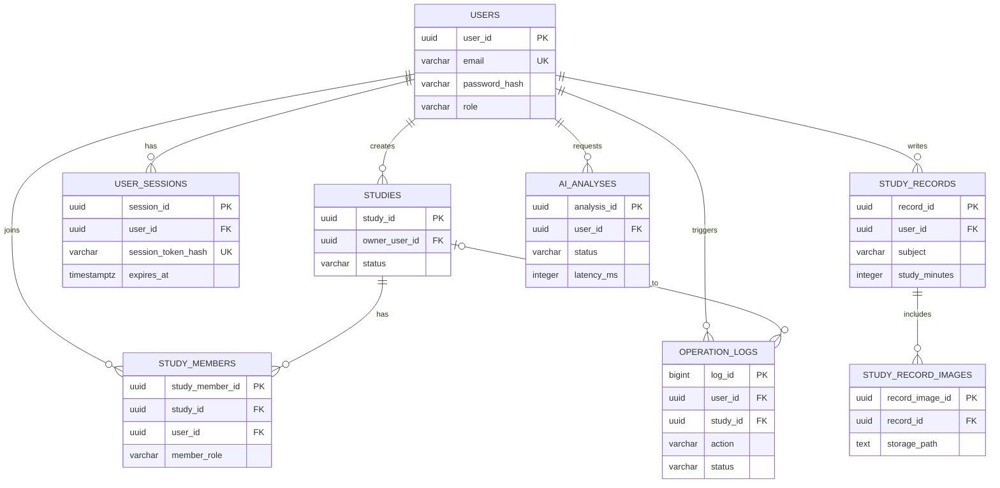
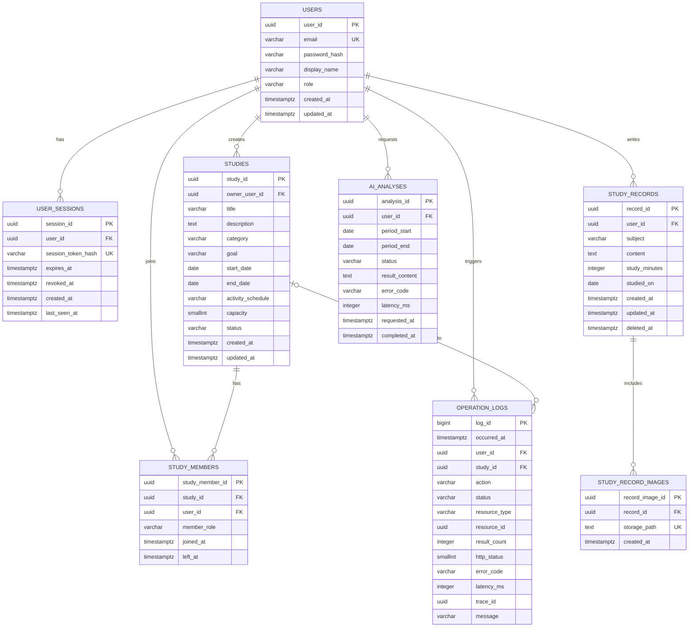
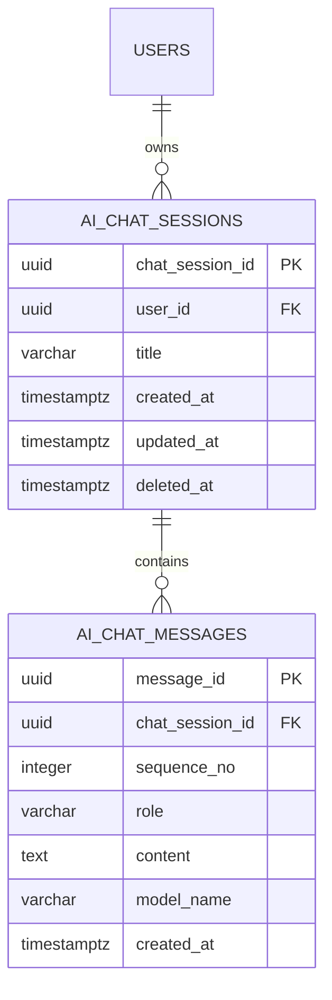

# 3단계｜데이터베이스 설계서

## 목차

1. 설계 목표와 범위
2. 설계 원칙
3. 논리 ERD
4. 물리 테이블 설계
5. 스터디 운영 규칙 초안(팀 합의 필요)
6. 테이블 관계와 정규화 근거
7. Supabase Storage·보안 원칙
8. 사용자 피드백 후보 테이블(팀 합의 필요)
9. Gemini 멀티턴 채팅 후보(팀 합의 필요)

## 1. 설계 목표와 범위

이 문서는 스터디 관리 웹 서비스의 **후속 확장 목표 데이터 구조**를 정의합니다. 데이터베이스는 Supabase의 PostgreSQL을 사용하며, 사용자·학습 기록·스터디 모집과 참여·AI 학습 분석·운영 로그 데이터를 관리합니다.

> **후속 확장 목표 설계:** 현재 구현의 기준은 `03_데이터베이스_설계서_MVP.md`와 `03_API_명세서_MVP.md`입니다. 이 문서는 서버 세션, 분석 이력, 여러 인증 사진, 상세 로그 등 기능 확장 시 적용합니다.

### 확장 설계 포함 범위

- 사용자 계정과 사용자·관리자 역할 관리
- 서버 세션 기반 로그인 상태 관리
- 학습 기록 등록·수정·삭제와 인증 사진 참조 관리
- 스터디 생성·검색·조회와 참여·탈퇴 관리
- AI 학습 분석 요청·결과·성공·실패 상태 관리
- 관리자 대시보드용 운영 로그 저장과 조회

### 후보 범위

- 공지, 할 일, 출석 등 스터디 운영 기능
- 목표 달성 리마인드 등 학습 동기 유지 기능
- AI 분석 결과에 대한 점수·의견 피드백 기능

후보 범위는 MVP 핵심 테이블과 분리하여 관리하며, 팀 합의 후 추가합니다.

## 2. 설계 원칙

- 영속 데이터는 Supabase PostgreSQL에 저장합니다.
- 사용자 프론트엔드와 관리자 프론트엔드는 Supabase에 직접 연결하지 않고 FastAPI를 통해 데이터에 접근합니다.
- 비밀번호는 평문으로 저장하지 않고 검증된 해싱 알고리즘으로 생성한 `password_hash`만 저장합니다.
- JWT 대신 의미 없는 난수 세션 ID를 보안 쿠키로 전달하고, Database에는 세션 ID의 해시와 만료·폐기 상태만 저장합니다.
- 시간 정보는 `TIMESTAMPTZ`로 저장하고, 기본값은 `NOW()`를 사용합니다.
- 삭제 이력이 필요한 데이터는 `deleted_at`을 사용한 논리 삭제를 우선 검토합니다. 이 문서에서는 학습 기록에 적용합니다.
- 인증 사진 파일은 Database에 직접 저장하지 않고 Supabase Storage에 저장하며, Database에는 Storage 경로만 저장합니다.
- 로그에는 비밀번호, 인증 정보, 인증 사진 원본, 상세 학습 내용 등 민감 정보를 저장하지 않습니다.

### 성능 인덱스 적용 방침

현재 MVP에서는 `PRIMARY KEY`, `UNIQUE` 제약조건으로 데이터의 식별·중복 방지를 우선 보장하며, 별도의 조회 성능 인덱스는 적용하지 않습니다. 학습 기록·스터디·운영 로그 데이터가 증가해 조회가 느려지는 시점에 실제 조회 성능을 측정한 뒤, 자주 사용하는 검색·정렬 조건을 대상으로 성능 인덱스를 후속 최적화 항목으로 추가합니다.

## 3. ERD

### 3.1 논리 ERD

### 3.2 물리 ERD

아래 물리 ERD는 확장 설계 테이블의 전체 컬럼과 PK·FK를 표시합니다. 사용자 피드백과 Gemini 멀티턴 채팅은 아직 후보 기능이므로 이 ERD에 포함하지 않았습니다.

## 4. 물리 테이블 설계

### 4.1 `users`

사용자 계정과 권한을 관리합니다.

| 컬럼 | 타입 | 제약조건·기본값 | 설명 |
| --- | --- | --- | --- |
| `user_id` | UUID | PK, `DEFAULT gen_random_uuid()` | 사용자 식별자 |
| `email` | VARCHAR(255) | `UNIQUE`, `NOT NULL` | 로그인 이메일 |
| `password_hash` | VARCHAR(255) | `NOT NULL` | 해싱된 비밀번호 |
| `display_name` | VARCHAR(50) | `NOT NULL` | 화면 표시 이름 |
| `role` | VARCHAR(20) | `NOT NULL`, `DEFAULT 'user'`, `CHECK (role IN ('user', 'admin'))` | 사용자 역할 |
| `created_at` | TIMESTAMPTZ | `NOT NULL`, `DEFAULT NOW()` | 가입 시각 |
| `updated_at` | TIMESTAMPTZ | `NOT NULL`, `DEFAULT NOW()` | 수정 시각 |

### 4.2 `user_sessions`

JWT를 사용하지 않는 서버 세션의 로그인 상태를 관리합니다. 브라우저에는 세션 ID 원문을 보안 쿠키로 전달하고, 이 테이블에는 해싱된 값만 저장합니다.

| 컬럼 | 타입 | 제약조건·기본값 | 설명 |
| --- | --- | --- | --- |
| `session_id` | UUID | PK, `DEFAULT gen_random_uuid()` | 세션 행 식별자 |
| `user_id` | UUID | FK → `users.user_id`, `NOT NULL` | 로그인 사용자 |
| `session_token_hash` | VARCHAR(255) | `UNIQUE`, `NOT NULL` | 세션 ID 원문의 해시 |
| `expires_at` | TIMESTAMPTZ | `NOT NULL` | 세션 만료 시각 |
| `revoked_at` | TIMESTAMPTZ | `NULL` | 로그아웃 또는 강제 만료 시각 |
| `created_at` | TIMESTAMPTZ | `NOT NULL`, `DEFAULT NOW()` | 로그인 시각 |
| `last_seen_at` | TIMESTAMPTZ | `NOT NULL`, `DEFAULT NOW()` | 마지막 인증 확인 시각 |

### 4.3 `studies`

스터디 모집 정보와 생성자를 관리합니다.

| 컬럼 | 타입 | 제약조건·기본값 | 설명 |
| --- | --- | --- | --- |
| `study_id` | UUID | PK, `DEFAULT gen_random_uuid()` | 스터디 식별자 |
| `owner_user_id` | UUID | FK → `users.user_id`, `NOT NULL` | 스터디 생성자 |
| `title` | VARCHAR(100) | `NOT NULL` | 스터디 이름 |
| `description` | TEXT | `NULL` | 스터디 소개 |
| `category` | VARCHAR(50) | `NOT NULL` | 관심 분야 또는 과목 |
| `goal` | VARCHAR(255) | `NOT NULL` | 스터디 목표 |
| `start_date` | DATE | `NULL` | 스터디 진행 시작일 |
| `end_date` | DATE | `NULL`, `CHECK (end_date >= start_date)` | 스터디 진행 종료일 |
| `activity_schedule` | VARCHAR(255) | `NOT NULL` | 활동 시간대 또는 일정 설명 |
| `capacity` | SMALLINT | `NOT NULL`, `CHECK (capacity BETWEEN 2 AND 100)` | 최대 참여 인원. 현재 MVP API의 상한 20명은 별도 구현 제한 |
| `status` | VARCHAR(20) | `NOT NULL`, `DEFAULT 'recruiting'`, `CHECK (status IN ('recruiting', 'closed'))` | 모집 상태 |
| `created_at` | TIMESTAMPTZ | `NOT NULL`, `DEFAULT NOW()` | 생성 시각 |
| `updated_at` | TIMESTAMPTZ | `NOT NULL`, `DEFAULT NOW()` | 수정 시각 |

### 4.4 `study_members`

사용자와 스터디의 다대다 참여 관계를 관리합니다.

| 컬럼 | 타입 | 제약조건·기본값 | 설명 |
| --- | --- | --- | --- |
| `study_member_id` | UUID | PK, `DEFAULT gen_random_uuid()` | 참여 관계 식별자 |
| `study_id` | UUID | FK → `studies.study_id`, `NOT NULL` | 참여 스터디 |
| `user_id` | UUID | FK → `users.user_id`, `NOT NULL` | 참여 사용자 |
| `member_role` | VARCHAR(20) | `NOT NULL`, `DEFAULT 'member'`, `CHECK (member_role IN ('owner', 'member'))` | 스터디 내 역할 |
| `joined_at` | TIMESTAMPTZ | `NOT NULL`, `DEFAULT NOW()` | 참여 시각 |
| `left_at` | TIMESTAMPTZ | `NULL` | 탈퇴 시각. `NULL`이면 참여 중 |

제약조건: `UNIQUE (study_id, user_id)`로 동일 사용자의 중복 참여를 막습니다. 스터디 생성 시 생성자를 `owner_user_id`에 저장하고, 동시에 `study_members`에 `member_role = 'owner'`로 등록합니다.

### 4.5 `study_records`

개인 사용자의 학습 기록을 관리합니다.

| 컬럼 | 타입 | 제약조건·기본값 | 설명 |
| --- | --- | --- | --- |
| `record_id` | UUID | PK, `DEFAULT gen_random_uuid()` | 학습 기록 식별자 |
| `user_id` | UUID | FK → `users.user_id`, `NOT NULL` | 작성자 |
| `subject` | VARCHAR(100) | `NOT NULL` | 과목 또는 학습 분야 |
| `content` | TEXT | `NULL` | 학습 내용 |
| `study_minutes` | INTEGER | `NOT NULL`, `CHECK (study_minutes > 0)` | 공부 시간(분) |
| `studied_on` | DATE | `NOT NULL` | 학습한 날짜 |
| `created_at` | TIMESTAMPTZ | `NOT NULL`, `DEFAULT NOW()` | 등록 시각 |
| `updated_at` | TIMESTAMPTZ | `NOT NULL`, `DEFAULT NOW()` | 수정 시각 |
| `deleted_at` | TIMESTAMPTZ | `NULL` | 논리 삭제 시각 |

### 4.6 `study_record_images`

학습 기록에 첨부한 인증 사진의 Storage 경로를 관리합니다.

| 컬럼 | 타입 | 제약조건·기본값 | 설명 |
| --- | --- | --- | --- |
| `record_image_id` | UUID | PK, `DEFAULT gen_random_uuid()` | 이미지 참조 식별자 |
| `record_id` | UUID | FK → `study_records.record_id`, `NOT NULL` | 연결된 학습 기록 |
| `storage_path` | TEXT | `NOT NULL`, `UNIQUE` | Supabase Storage 객체 경로 |
| `created_at` | TIMESTAMPTZ | `NOT NULL`, `DEFAULT NOW()` | 등록 시각 |

### 4.7 `ai_analyses`

사용자가 요청한 AI 학습 분석의 처리 상태와 결과를 관리합니다.

| 컬럼 | 타입 | 제약조건·기본값 | 설명 |
| --- | --- | --- | --- |
| `analysis_id` | UUID | PK, `DEFAULT gen_random_uuid()` | 분석 식별자 |
| `user_id` | UUID | FK → `users.user_id`, `NOT NULL` | 요청 사용자 |
| `period_start` | DATE | `NOT NULL` | 분석 시작일 |
| `period_end` | DATE | `NOT NULL`, `CHECK (period_end >= period_start)` | 분석 종료일 |
| `status` | VARCHAR(20) | `NOT NULL`, `DEFAULT 'pending'`, `CHECK (status IN ('pending', 'success', 'failed'))` | 처리 상태 |
| `result_content` | TEXT | `NULL` | Gemini 분석 결과 |
| `error_code` | VARCHAR(100) | `NULL` | 실패 코드 |
| `latency_ms` | INTEGER | `NULL`, `CHECK (latency_ms >= 0)` | Gemini 요청·응답 시간(ms) |
| `requested_at` | TIMESTAMPTZ | `NOT NULL`, `DEFAULT NOW()` | 요청 시각 |
| `completed_at` | TIMESTAMPTZ | `NULL` | 처리 완료 시각 |

### 4.8 `operation_logs`

관리자 대시보드에서 기능 이용량과 오류 현황을 조회하기 위한 운영 로그를 관리합니다.

| 컬럼 | 타입 | 제약조건·기본값 | 설명 |
| --- | --- | --- | --- |
| `log_id` | BIGINT | PK, `GENERATED ALWAYS AS IDENTITY` | 로그 식별자 |
| `occurred_at` | TIMESTAMPTZ | `NOT NULL`, `DEFAULT NOW()` | 이벤트 발생 시각 |
| `user_id` | UUID | FK → `users.user_id`, `NULL` | 요청 사용자. 비로그인 요청은 `NULL` |
| `study_id` | UUID | FK → `studies.study_id`, `NULL` | 관련 스터디 |
| `action` | VARCHAR(100) | `NOT NULL` | 기능 또는 이벤트 유형. 예: `record.create` |
| `status` | VARCHAR(20) | `NOT NULL`, `CHECK (status IN ('success', 'failure'))` | 성공·실패 상태 |
| `resource_type` | VARCHAR(30) | `NULL`, `CHECK (resource_type IN ('record', 'study', 'analysis', 'auth'))` | 관련 데이터 유형 |
| `resource_id` | UUID | `NULL` | 관련 데이터 식별자. `resource_type`에 따라 학습 기록·스터디·AI 분석을 가리킴 |
| `result_count` | INTEGER | `NULL`, `CHECK (result_count >= 0)` | 검색·조회 결과 수. 검색 결과 없음은 `0` |
| `http_status` | SMALLINT | `NULL`, `CHECK (http_status BETWEEN 100 AND 599)` | API 응답 HTTP 상태 코드 |
| `error_code` | VARCHAR(100) | `NULL` | 오류 코드 |
| `latency_ms` | INTEGER | `NULL`, `CHECK (latency_ms >= 0)` | 요청 처리 시간(ms) |
| `trace_id` | UUID | `NULL` | 동일 요청 흐름 추적 식별자 |
| `message` | VARCHAR(500) | `NULL` | 민감 정보를 제외한 요약 메시지 |

`resource_id`는 여러 테이블을 가리킬 수 있는 범용 식별자이므로 외래 키로 연결하지 않습니다. FastAPI는 `resource_type`과 `resource_id`를 함께 기록해 특정 학습 기록·스터디·AI 분석 요청에 연결된 로그를 추적합니다.

## 5. 스터디 운영 규칙 초안｜팀 합의 필요

> 아래 규칙은 스터디 기능을 일관되게 구현하기 위한 초안입니다. 정원 정책과 생성자 탈퇴 정책은 사용자 경험에 영향을 주므로 팀 합의 후 확정합니다.

| 구분 | 규칙 초안 | FastAPI·Database 처리 기준 |
| --- | --- | --- |
| 스터디 생성 | 로그인 사용자는 스터디를 생성할 수 있습니다. 생성자는 최초 소유자입니다. | 하나의 트랜잭션에서 `studies`를 생성하고, 동일 사용자를 `study_members`에 `owner`로 등록합니다. |
| 스터디 검색·조회 | 모든 로그인 사용자는 모집 중 또는 조회 권한이 있는 스터디를 검색·조회할 수 있습니다. | `status`, `category`, 활동 시간대 조건으로 조회하며, 참여자 목록은 `left_at IS NULL`인 행만 표시합니다. |
| 참여 | 모집 상태가 `recruiting`이고 활성 참여 인원이 정원보다 적을 때만 참여할 수 있습니다. | 트랜잭션에서 활성 참여 인원을 확인한 뒤 `study_members`에 행을 추가합니다. 동일 사용자의 중복 참여는 `UNIQUE (study_id, user_id)` 제약조건으로 차단합니다. |
| 탈퇴·재참여 | 일반 참여자는 탈퇴할 수 있습니다. 탈퇴 후 재참여 허용 여부는 후속 정책으로 결정합니다. | 이 확장 설계에서는 탈퇴 시 `left_at`을 기록하며, 동일 사용자 재참여는 허용하지 않습니다. 재참여 기능이 필요해지면 참여 이력 관리 방식을 별도로 확장합니다. |
| 생성자 탈퇴 | 생성자는 일반 탈퇴를 할 수 없습니다. 먼저 활성 참여자에게 소유권을 이전하거나, 참여자가 없으면 스터디를 `closed` 상태로 전환합니다. | 소유권 이전 시 `studies.owner_user_id`와 두 `study_members.member_role`을 하나의 트랜잭션에서 변경합니다. |
| 정보 수정 | 생성자만 스터디 정보와 모집 상태를 수정할 수 있습니다. | 정원을 줄일 때 현재 활성 참여 인원보다 작게 설정할 수 없습니다. |
| 모집 종료 | `closed` 상태의 스터디는 신규 참여를 받지 않습니다. 기존 참여자는 조회할 수 있습니다. | 참여 API에서 `status = 'recruiting'`을 반드시 검증합니다. |
| 동시 참여 요청 | 여러 사용자가 동시에 참여하더라도 정원을 초과하면 안 됩니다. | 참여 인원 확인과 참여 행 추가를 하나의 Database 트랜잭션으로 처리합니다. |

## 6. 테이블 관계와 정규화 근거

### 관계 요약

| 관계 | 카디널리티 | 설명 |
| --- | --- | --- |
| `users` → `studies` | 1:N | 한 사용자는 여러 스터디를 생성할 수 있습니다. |
| `users` → `user_sessions` | 1:N | 한 사용자는 여러 브라우저 또는 기기에서 로그인 세션을 가질 수 있습니다. |
| `users` ↔ `studies` | N:M | `study_members`를 통해 여러 사용자가 여러 스터디에 참여합니다. |
| `users` → `study_records` | 1:N | 한 사용자는 여러 학습 기록을 작성할 수 있습니다. |
| `study_records` → `study_record_images` | 1:N | 한 학습 기록에는 여러 인증 사진을 첨부할 수 있습니다. |
| `users` → `ai_analyses` | 1:N | 한 사용자는 여러 분석을 요청할 수 있습니다. |
| `users` → `operation_logs` | 1:N | 한 사용자의 기능 요청은 여러 로그를 생성할 수 있습니다. |

### 3정규화 근거

- 사용자 정보는 `users`에만 저장하고, 세션·스터디·학습 기록·분석·로그에는 `user_id`만 저장합니다. 따라서 이메일이나 표시 이름 변경 시 중복 데이터를 수정하는 갱신 이상을 방지합니다.
- 스터디 정보와 참여자 정보는 `studies`와 `study_members`로 분리합니다. 참여자 목록을 `studies`에 반복 저장하지 않아 다대다 관계를 정상화합니다.
- 학습 기록과 인증 사진 경로는 `study_records`와 `study_record_images`로 분리합니다. 여러 이미지를 반복 컬럼 없이 관리할 수 있습니다.
- AI 분석 결과와 운영 로그는 목적과 갱신 주기가 다르므로 `ai_analyses`와 `operation_logs`로 분리합니다. 분석 결과 조회와 관리자 로그 집계를 독립적으로 처리할 수 있습니다.

## 7. Supabase Storage·보안 원칙

- 인증 사진은 Supabase Storage의 전용 버킷에 저장하고, `study_record_images.storage_path`로만 참조합니다.
- 파일 경로는 사용자별·학습 기록별 디렉터리 규칙을 사용합니다. 예: `records/{user_id}/{record_id}/{file_name}`
- Storage 파일 접근과 Database 변경은 FastAPI에서 사용자 권한을 검증한 뒤 처리합니다.
- 사용자 프론트엔드와 관리자 프론트엔드에는 Supabase 서비스 역할 키와 Gemini API 키를 노출하지 않습니다.
- Render에는 Supabase 연결 정보, Storage 설정, Gemini API 키, 비밀번호 해싱 관련 설정을 환경변수로 저장합니다.
- 로그인 성공 시 FastAPI는 예측 불가능한 세션 ID를 발급하고, 브라우저에는 `HttpOnly`, `Secure`, `SameSite` 속성을 적용한 쿠키로 전달합니다. Database에는 세션 ID 원문이 아닌 해시만 저장합니다.
- 로그아웃·세션 만료·비밀번호 변경 시 해당 `user_sessions` 행의 `revoked_at`을 기록해 재사용을 차단합니다.
- 관리자 로그 조회는 관리자 역할이 확인된 요청만 허용합니다.

## 8. 사용자 피드백 후보 테이블｜팀 합의 필요

> AI 분석 결과에 대한 점수·의견 수집 기능은 확정되지 않았습니다. 아래 테이블은 도입이 합의될 경우 추가하는 후보 설계입니다.

### `analysis_feedbacks` 후보

| 컬럼 | 타입 | 제약조건·기본값 | 설명 |
| --- | --- | --- | --- |
| `feedback_id` | UUID | PK, `DEFAULT gen_random_uuid()` | 피드백 식별자 |
| `analysis_id` | UUID | FK → `ai_analyses.analysis_id`, `NOT NULL`, `UNIQUE` | 평가 대상 분석. 분석 1건당 1회 평가 |
| `user_id` | UUID | FK → `users.user_id`, `NOT NULL` | 작성자 |
| `score` | SMALLINT | `NOT NULL`, `CHECK (score BETWEEN 1 AND 5)` | 만족도 점수 |
| `comment` | TEXT | `NULL` | 선택 의견 |
| `created_at` | TIMESTAMPTZ | `NOT NULL`, `DEFAULT NOW()` | 작성 시각 |
| `updated_at` | TIMESTAMPTZ | `NOT NULL`, `DEFAULT NOW()` | 수정 시각 |

도입 시 FastAPI는 `analysis_id`의 소유자와 `user_id`가 일치하는지 검증합니다. 관리자 화면에서는 점수 분포, 의견 수, 낮은 점수의 분석 유형을 집계합니다.

## 9. Gemini 멀티턴 채팅 후보｜팀 합의 필요

> Gemini와의 멀티턴 대화 이력 저장 기능은 현재 확정되지 않았습니다. 도입 시 대화 원문은 운영 로그와 분리해 사용자 데이터로 저장하며, 본인만 조회·삭제할 수 있도록 FastAPI에서 권한을 검증합니다.

### `ai_chat_sessions` 후보

| 컬럼 | 타입 | 제약조건·기본값 | 설명 |
| --- | --- | --- | --- |
| `chat_session_id` | UUID | PK, `DEFAULT gen_random_uuid()` | 대화 세션 식별자 |
| `user_id` | UUID | FK → `users.user_id`, `NOT NULL` | 대화 소유자 |
| `title` | VARCHAR(200) | `NULL` | 대화 제목 |
| `created_at` | TIMESTAMPTZ | `NOT NULL`, `DEFAULT NOW()` | 생성 시각 |
| `updated_at` | TIMESTAMPTZ | `NOT NULL`, `DEFAULT NOW()` | 마지막 메시지 시각 |
| `deleted_at` | TIMESTAMPTZ | `NULL` | 사용자의 대화 삭제 시각 |

### `ai_chat_messages` 후보

| 컬럼 | 타입 | 제약조건·기본값 | 설명 |
| --- | --- | --- | --- |
| `message_id` | UUID | PK, `DEFAULT gen_random_uuid()` | 메시지 식별자 |
| `chat_session_id` | UUID | FK → `ai_chat_sessions.chat_session_id`, `NOT NULL` | 소속 대화 세션 |
| `sequence_no` | INTEGER | `NOT NULL`, `CHECK (sequence_no > 0)`, `UNIQUE (chat_session_id, sequence_no)` | 세션 내 메시지 순서 |
| `role` | VARCHAR(20) | `NOT NULL`, `CHECK (role IN ('user', 'assistant', 'system'))` | 메시지 작성 주체 |
| `content` | TEXT | `NOT NULL` | 대화 내용 |
| `model_name` | VARCHAR(100) | `NULL` | Gemini 모델명. 사용자 메시지는 `NULL` 가능 |
| `created_at` | TIMESTAMPTZ | `NOT NULL`, `DEFAULT NOW()` | 생성 시각 |

FastAPI는 사용자가 보낸 메시지와 해당 세션의 이전 메시지를 `sequence_no` 순서로 조회해 Gemini에 전달합니다. Gemini 응답도 같은 세션에 `role = 'assistant'`로 저장합니다. 기술 운영 로그에는 대화 원문을 저장하지 않고, 요청 성공·실패·응답 시간·오류 코드만 `operation_logs`에 기록합니다.
