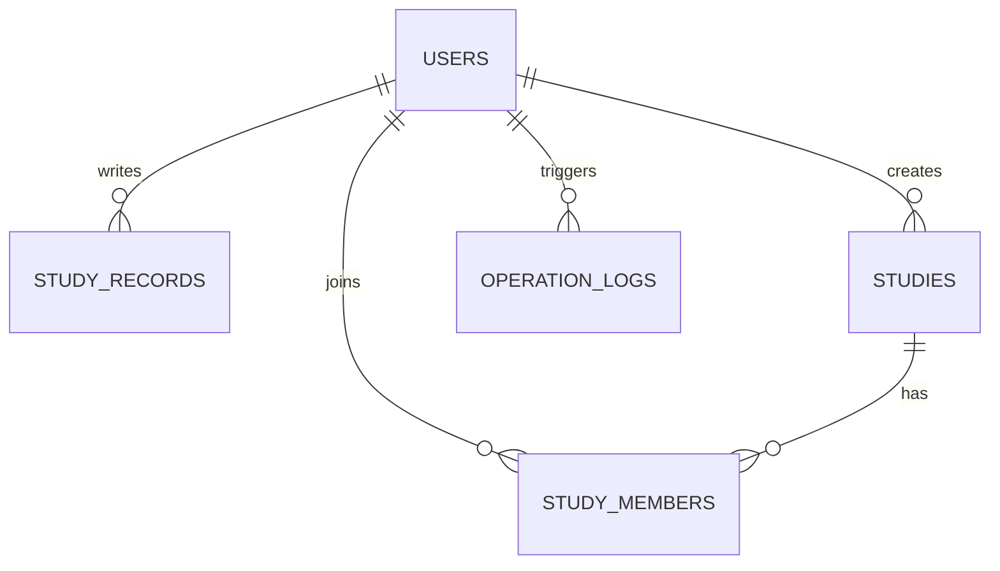

# 3단계｜데이터베이스 설계서 (간소화 MVP)

## 이 문서는 무엇이 다른가요?

이 문서는 기능을 빠르게 완성하기 위한 **간소화 MVP** 설계입니다. 기존 [상세 데이터베이스 설계서](03_데이터베이스_설계서.md)의 8개 테이블 대신 5개 테이블만 사용합니다.

> **현재 구현 기준 문서:** 실제 구현은 이 문서와 `03_API_명세서_MVP.md`를 기준으로 합니다. 상세 데이터베이스 설계서는 기능 확장 시 적용할 목표 설계입니다.

| 상세 설계의 기능 | 간소화 MVP 처리 방법 |
| --- | --- |
| DB 세션 테이블 | Streamlit `session_state`로 현재 로그인 사용자만 유지 |
| 인증 사진 별도 테이블 | 학습 기록 1건에 사진 경로 1개만 저장 |
| AI 분석 결과 이력 | Gemini 결과를 화면에 바로 표시하고, 성공·실패만 로그에 저장 |
| 복잡한 운영 로그 | 기능명·성공 여부·오류 메시지·응답 시간만 저장 |
| 탈퇴 이력·재참여 | 탈퇴 시 참여 행을 삭제. 재참여 가능 |
| 생성자 소유권 이전 | MVP에서는 생성자가 탈퇴하지 않음 |

> 이 방식은 학습·시연 목적의 난도 감소안입니다. Render에 공개 배포하거나 실제 사용자 정보를 다루는 단계에서는 상세 설계의 서버 세션·권한 검증 구조로 확장해야 합니다.

> **성능 인덱스 방침:** 현재 MVP는 `PRIMARY KEY`, `UNIQUE` 제약조건만 사용합니다. 조회 성능 인덱스는 데이터가 늘어나 실제로 느려질 때 후속 최적화로 추가합니다.

## 1. 최소 테이블 5개

| 테이블 | 역할 |
| --- | --- |
| `users` | 회원과 관리자 구분 |
| `study_records` | 개인 학습 기록과 인증 사진 경로 |
| `studies` | 스터디 모집 글 |
| `study_members` | 스터디 참여자 |
| `operation_logs` | 관리자용 성공·실패 로그 |

## 2. 관계 한눈에 보기

## 3. 테이블별 최소 필드

### 3.1 `users`

| 필드 | 설명 |
| --- | --- |
| `user_id` | 사용자 번호 |
| `email` | 로그인 이메일. 중복 불가 |
| `password_hash` | 해싱한 비밀번호 |
| `name` | 사용자 이름 |
| `role` | `user` 또는 `admin` |

### 3.2 `study_records`

| 필드 | 설명 |
| --- | --- |
| `record_id` | 학습 기록 번호 |
| `user_id` | 작성한 사용자 번호 |
| `subject` | 과목 |
| `content` | 학습 내용 |
| `study_minutes` | 공부 시간(분) |
| `studied_on` | 공부한 날짜 |
| `proof_image_path` | 인증 사진 경로. 사진이 없으면 비워 둠 |

사진 파일은 Supabase Storage에 업로드하고, 이 테이블에는 파일 경로만 저장합니다. 한 기록당 사진 한 장만 허용해 구조를 단순화합니다.

### 3.3 `studies`

| 필드 | 설명 |
| --- | --- |
| `study_id` | 스터디 번호 |
| `owner_user_id` | 스터디를 만든 사용자 번호 |
| `title` | 스터디 이름 |
| `category` | 분야 또는 과목 |
| `goal` | 목표 |
| `schedule` | 활동 시간대 |
| `capacity` | 최대 참여 인원 |
| `status` | `recruiting` 또는 `closed` |

### 3.4 `study_members`

| 필드 | 설명 |
| --- | --- |
| `study_member_id` | 참여 정보 번호 |
| `study_id` | 참여한 스터디 번호 |
| `user_id` | 참여한 사용자 번호 |
| `joined_at` | 참여 시각 |

`study_id`와 `user_id` 조합은 중복될 수 없게 설정합니다. 탈퇴할 때는 이 행을 삭제하므로, 나중에 다시 참여할 수 있습니다.

### 3.5 `operation_logs`

| 필드 | 설명 |
| --- | --- |
| `log_id` | 로그 번호 |
| `created_at` | 발생 시각 |
| `user_id` | 요청한 사용자 번호 |
| `action` | 기능 이름. 예: `record.create` |
| `status` | `success` 또는 `failure` |
| `message` | 오류 또는 처리 결과 요약 |
| `latency_ms` | 처리 시간. AI 요청일 때 사용 |
| `trace_id` | 요청 1건을 구분하는 번호. 오류 응답과 로그를 연결할 때 사용 |

## 4. 쉬운 기능 규칙

| 기능 | MVP 규칙 |
| --- | --- |
| 회원가입 | 공개 회원가입 계정은 항상 `role = user`로 생성. 관리자 계정은 별도 초기 데이터 또는 운영 절차로 생성 |
| 로그인 | 이메일·비밀번호가 맞으면 Streamlit `session_state`에 `user_id`, `role` 저장. `user_id`는 MVP에서 데이터 연결용으로만 사용 |
| 학습 기록 | 화면은 현재 세션의 사용자 기록만 표시·수정 대상으로 사용. 백엔드의 본인 확인은 서버 세션 인증 단계에서 추가 |
| 학습 통계 | 본인 `study_records`의 과목별 `study_minutes` 합계 표시 |
| 스터디 생성 | 로그인한 사용자가 생성하며, 생성자는 자동으로 참여자 목록에 추가 |
| 스터디 참여 | 모집 중이고 참여 인원이 정원보다 적으면 참여 |
| 스터디 탈퇴 | `study_members`에서 본인 참여 행 삭제 |
| 스터디 수정 | 화면은 `owner_user_id`가 현재 세션 사용자와 같을 때만 수정 버튼 표시. 백엔드 생성자 검증은 서버 세션 인증 단계에서 추가 |
| AI 분석 | 본인 학습 기록을 FastAPI가 조회해 Gemini에 전달하고 결과를 화면에 표시 |
| 관리자 로그 | 화면은 `role = admin`일 때만 로그 메뉴 표시. 백엔드 관리자 권한 검증은 서버 세션 인증 단계에서 추가 |

모든 FastAPI 요청이 성공·실패하면 `operation_logs`에 한 줄을 저장합니다.

## 5. 만들기 순서

1. `users` 테이블을 만들고 회원가입·로그인을 구현합니다.
2. `study_records` 테이블로 학습 기록 등록·목록·수정·삭제를 구현합니다.
3. 과목별 공부 시간 합계를 화면에 표시합니다.
4. `studies`, `study_members`로 스터디 생성·검색·참여·탈퇴를 구현합니다.
5. Gemini에 기록을 보내 분석 결과를 화면에 표시합니다.
6. 각 기능의 성공·실패를 `operation_logs`에 저장하고 관리자 화면에서 출력합니다.

## 6. 나중에 추가할 기능

- 안전한 DB 세션과 보안 쿠키 기반 로그인
- 학습 기록당 여러 인증 사진
- AI 분석 결과 저장과 이력 조회
- 스터디 탈퇴 이력·재참여 이력
- 생성자 권한 이전과 동시 참여 요청 처리
- 상세 오류 분류와 검색 결과 분석
- AI 평가, Gemini 멀티턴 채팅
- Redis, WebSocket/SSE

## 7. 이 설계로 가능한 것

- 회원가입·로그인
- 학습 기록 등록·수정·삭제, 과목별 공부 시간 확인
- 스터디 생성·검색·참여·탈퇴
- 저장된 본인 학습 기록 기반 Gemini 분석
- 관리자용 기본 성공·실패 로그 확인

먼저 이 기능을 모두 완성한 뒤, 필요할 때 상세 설계서의 테이블과 규칙을 하나씩 추가합니다.
