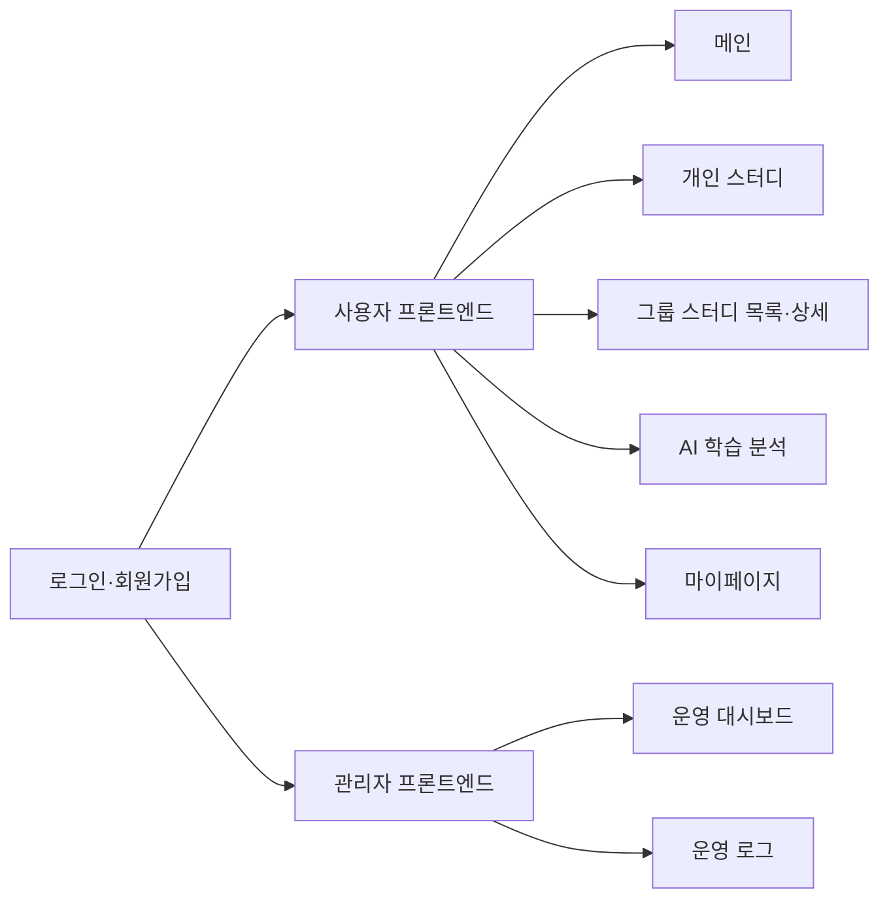

# 3단계｜화면 설계서 (MVP)

## 1. 기준과 범위

이 문서는 `03_API_명세서_MVP.md`, `03_데이터베이스_설계서_MVP.md`를 기준으로 작성합니다. 아키텍처 이미지처럼 사용자 프론트엔드와 관리자 프론트엔드는 별도 Streamlit 앱으로 운영하며, 두 앱은 FastAPI API를 호출합니다.

### 화면 구성



## 2. 정보 구조

| 프론트엔드 | 메뉴 | 목적 |
| --- | --- | --- |
| 사용자 | 메인 | 학습 기록 요약과 과목별 학습 시간 확인 |
| 사용자 | 개인 스터디 | 개인 학습 기록 등록·수정·삭제 |
| 사용자 | 그룹 스터디 | 그룹 스터디 검색·생성·참여·탈퇴 |
| 사용자 | AI 분석 | 기간을 선택해 저장된 학습 기록 분석 |
| 사용자 | 마이페이지 | 로그인 사용자 정보 확인·로그아웃 |
| 관리자 | 대시보드 | 사용자·스터디·기능 이용량·실패 건수 확인 |
| 관리자 | 운영 로그 | 성공·실패 로그 검색과 상세 확인 |

## 3. 공통 디자인 시스템

| 항목 | 규칙 |
| --- | --- |
| Primary | `#2563EB` |
| Success | `#16A34A` |
| Warning | `#D97706` |
| Error | `#DC2626` |
| 제목·본문 | 24px Bold / 14px Regular |
| 화면 여백·카드 간격 | 24px / 16px |
| 버튼 상태 | Default, Disabled, Loading |

Streamlit 기본 컴포넌트를 우선 사용합니다. 성공은 초록색 안내, 오류는 빨간색 안내, 빈 데이터는 등록·검색 버튼을 함께 표시합니다.

### 이미지 반영 공통 규칙

추가된 그룹 스터디 목록·상세·마이페이지 이미지를 기준으로 사용자 화면에는 좌측 고정 사이드바를 둡니다. 사이드바는 서비스명, `메인 · 개인 스터디 · 그룹 스터디 · 마이페이지 · AI 분석` 메뉴, 현재 로그인 사용자, 로그아웃 버튼으로 구성하며 현재 메뉴는 보라색 계열로 강조합니다. 본문은 흰색 카드, 보라색 주요 버튼, 초록색 모집·진행 상태 배지로 구성합니다.

## 4. 사용자 프론트엔드 화면

아래 ASCII 와이어프레임은 Streamlit 화면에서 컴포넌트를 배치할 위치를 나타냅니다.

### 4.1 로그인·회원가입

```text
+--------------------------------------------------+
| 스터디 관리                                       |
| [로그인] [회원가입]                               |
| 이메일      [____________________________]       |
| 비밀번호    [____________________________]       |
|                  [로그인]                         |
| 로그인 실패: 이메일 또는 비밀번호를 확인하세요.    |
+--------------------------------------------------+
```

회원가입 탭에서는 아래 입력 화면으로 전환합니다.

```text
+--------------------------------------------------+
| 회원가입                                          |
| 이름        [____________________________]       |
| 이메일      [____________________________]       |
| 비밀번호    [____________________________]       |
|                         [취소] [회원가입]         |
+--------------------------------------------------+
```

| 사용자 액션 | API | 성공·실패 처리 |
| --- | --- | --- |
| 회원가입 | `POST /auth/signup` | 성공 시 로그인 화면 표시, 이메일 중복은 오류 표시 |
| 로그인 | `POST /auth/login` | 성공 시 `st.session_state` 저장 후 사용자·관리자 화면으로 이동 |
| 로그아웃 | `POST /auth/logout` | 세션 상태 삭제 후 로그인 화면으로 이동 |

### 4.2 메인｜학습 기록·통계

```text
+--------------------------------------------------+
| [메인] [개인 스터디] [그룹 스터디] [마이페이지]      |
|                                                    |
| 이번 달 학습 시간  300분                           |
| [Python 180분] [SQL 120분]                         |
|                                                    |
| 최근 학습 기록                         [새로고침]  |
| 날짜        과목       시간       수정 / 삭제      |
| 08-07       Python     90분       [수정] [삭제]    |
|                                                    |
| 기록이 없습니다.                  [학습 기록 등록] |
+--------------------------------------------------+
```

| 표시·액션 | API | 상태 처리 |
| --- | --- | --- |
| 최근 학습 기록 표시 | `GET /records` | 결과 없음 시 등록 버튼 표시 |
| 기간별 과목 통계 | `GET /records/stats` | 로딩 중 스피너, 실패 시 재시도 버튼 |
| 기간 변경·새로고침 | 위 GET API 재호출 | 선택 기간과 조회 시각 표시 |

### 4.3 개인 스터디 목록

```text
+--------------------------------------------------+
| 개인 스터디                         [학습 기록 등록]|
| 날짜        과목       시간                    상세 |
| 08-07       Python     90분                 [상세] |
| 08-06       SQL        60분                 [상세] |
|                                                    |
| 기록이 없습니다.                  [학습 기록 등록] |
+--------------------------------------------------+
```

| 사용자 액션 | API | 상태 처리 |
| --- | --- | --- |
| 목록·기간·과목 조회 | `GET /records` | 결과 없음 시 등록 버튼 표시 |
| 기록 상세 이동 | `GET /records/{record_id}` | 선택한 기록의 상세 화면 표시 |
| 기록 등록 이동 | 없음 | 입력 화면으로 이동 |

### 4.4 개인 스터디 입력·수정

```text
+--------------------------------------------------+
| 학습 기록 등록                                    |
| 과목          [____________________________]     |
| 공부 시간(분) [____]                              |
| 학습 날짜     [2026-08-07]                        |
| 학습 내용     [____________________________]     |
| 인증 사진     [파일 선택]                         |
|                         [취소] [저장]             |
+--------------------------------------------------+
```

| 사용자 액션 | API | 상태 처리 |
| --- | --- | --- |
| 인증 사진 선택 | `POST /uploads/proof-image` | 업로드 중 Loading, 파일 형식·크기 오류 표시 |
| 기록 저장 | `POST /records` | 성공 시 목록으로 이동, 입력 오류는 해당 필드 아래 표시 |
| 기록 수정 | `PUT /records/{record_id}` | 성공 시 상세·목록 갱신 |
| 기록 삭제 | `DELETE /records/{record_id}` | 삭제 확인 후 목록 재조회 |

### 4.5 개인 스터디 상세

```text
+--------------------------------------------------+
| < 개인 스터디                                    |
| Python 학습 기록                                 |
| 학습 날짜       2026-08-07                       |
| 공부 시간       90분                              |
| 학습 내용       FastAPI 학습                      |
| 인증 사진       [이미지 미리보기]                 |
|                         [수정] [삭제]             |
+--------------------------------------------------+
```

| 사용자 액션 | API | 상태 처리 |
| --- | --- | --- |
| 상세 조회 | `GET /records/{record_id}` | 404 시 개인 스터디 목록으로 이동 |
| 수정 이동 | 없음 | 입력·수정 화면에 기존 값 표시 |
| 삭제 | `DELETE /records/{record_id}` | 확인 후 목록으로 이동 |

### 4.6 그룹 스터디 목록·탐색

```text
+--------------------------------------------------+
| 그룹 스터디                              [그룹 생성]|
|                                                    |
| 참여 중인 그룹                                     |
| [모집 중] FastAPI 스터디 | 백엔드 | 3 / 5명 [상세] |
|                                                    |
| 그룹 탐색                                          |
| 키워드 [________] 분야 [전체 v] 상태 [모집 중 v]   |
| [검색]                                             |
| ------------------------------------------------ |
| [모집 중] 알고리즘 매일 풀기 | 알고리즘 | 3 / 6명   |
|            월·수 19:00                     [상세] |
| ------------------------------------------------ |
| 검색 결과가 없습니다.             [스터디 생성]   |
+--------------------------------------------------+
```

| 사용자 액션 | API | 상태 처리 |
| --- | --- | --- |
| 참여 중인 그룹 표시 | `GET /studies` | 응답의 `is_joined=true` 항목을 별도 카드 영역에 표시 |
| 검색·필터 변경 | `GET /studies?source=search` | 결과 없음 시 생성 버튼 표시 |
| 스터디 생성 | `POST /studies` | 성공 시 상세 화면 이동 |
| 새로고침 | `GET /studies` | 최신 참여 인원·모집 상태 표시 |

스터디 목록은 5~10초마다 `GET /studies?source=list`를 다시 호출해 다른 사용자의 참여·탈퇴와 모집 상태 변경을 반영합니다. 사용자는 언제든 새로고침 버튼으로 즉시 다시 조회할 수 있습니다.

#### 그룹 생성·수정 입력

```text
+--------------------------------------------------+
| 그룹 생성 / 그룹 수정                             |
| 그룹명      [____________________________]       |
| 분야        [____________________________]       |
| 공동 목표   [____________________________]       |
| 활동 일정   [예: 월·수 19:00______________]      |
| 모집 인원   [__]명                                |
| 모집 상태   [모집 중 v]                            |
|                         [취소] [저장]             |
+--------------------------------------------------+
```

생성 화면은 `POST /studies`, 수정 화면은 `PUT /studies/{study_id}`를 호출합니다. 제목·모집 인원 같은 입력 오류는 해당 필드 아래에 표시하고, 저장 성공 후 그룹 상세 화면을 다시 조회합니다.

### 4.7 그룹 스터디 상세

```text
+--------------------------------------------------+
| < 그룹 스터디   알고리즘 매일 풀기                 |
| [알고리즘] [모집 중]                 참여 3 / 6명 |
| 매일 알고리즘 문제를 풀고 인증하는 그룹입니다.       |
|                                  [참여하기]        |
|                                                    |
| [그룹 소개]      [공동 목표: 매일 한 문제 풀이]     |
| [진행 일정]      시작일 / 종료일 / 모임: 월·수 19시 |
| [참여자]         홍길동(생성자), 김스터디, 이학습   |
| 참여 전: [참여하기] / 참여 후: [탈퇴하기]           |
| 생성자만 표시: [그룹 수정]                         |
+--------------------------------------------------+
```

| 사용자 액션 | API | 상태 처리 |
| --- | --- | --- |
| 상세·참여자 조회 | `GET /studies/{study_id}` | 404 시 목록으로 돌아가기 |
| 참여 | `POST /studies/{study_id}/join` | 성공 후 상세 재조회, 정원 초과·모집 종료 안내 |
| 탈퇴 | `DELETE /studies/{study_id}/join` | 성공 후 상세 재조회 |
| 스터디 수정 | `PUT /studies/{study_id}` | 저장 후 상세 갱신 |

스터디 상세도 5~10초 주기로 다시 조회합니다.

#### 이미지 기준 확장 데이터

그룹 상세 이미지의 `그룹 소개`, `시작일`, `종료일`은 현재 MVP의 `title · category · goal · schedule · capacity` 응답에 포함되지 않습니다. MVP에서는 `goal`을 공동 목표로 표시하고, 소개와 시작·종료일은 비워 두거나 미표시합니다. 이미지와 동일하게 구현하려면 `studies` 및 `StudyRequest/StudyResponse`에 아래 필드를 추가하는 확장이 필요합니다.

| 추가 필드 | 용도 |
| --- | --- |
| `description` | 그룹 소개 |
| `start_date`, `end_date` | 진행 기간 |

그룹 수정 버튼은 `study.owner_user_id`와 Streamlit 세션의 `user_id`가 같을 때만 표시합니다. 이는 MVP의 화면 표시 규칙이며, 실제 권한 검증은 인증 기능 추가 단계에서 백엔드에도 적용합니다.

### 4.8 AI 학습 분석

```text
+--------------------------------------------------+
| AI 학습 분석                                       |
| 분석 기간  [2026-08-01] ~ [2026-08-31] [분석 요청] |
|                                                    |
| 요약: 이번 달 총 학습 시간은 300분입니다.           |
| 강점: Python 학습이 꾸준합니다.                     |
| 개선: SQL 학습 시간을 늘려보세요.                   |
| 다음 목표: 다음 주 SQL 120분                        |
| 기록이 없으면 [학습 기록 등록]                      |
+--------------------------------------------------+
```

| 사용자 액션 | API | 상태 처리 |
| --- | --- | --- |
| 분석 기간 선택·요청 | `POST /analyses` | 요청 중 Loading, 결과 표시 |
| 기록 없음 | `404 NO_STUDY_RECORDS` | 학습 기록 등록 버튼 표시 |
| Gemini 실패 | `500/503` | 오류 안내와 재시도 버튼 표시 |

#### 팀 합의 필요 후보｜AI 분석 평가

AI 분석 결과 아래에 `만족도 [1~5]`, `의견 [선택 입력]`, `[평가 제출]`을 배치하는 방안을 후보로 둡니다. 팀이 확정할 경우 `POST /analyses/{analysis_id}/feedback`을 호출하고, 성공 시 “평가가 저장되었습니다”, 입력 오류 시 필드별 오류를 표시합니다. 현재 MVP 구현 범위에는 포함하지 않습니다.

### 4.9 마이페이지

```text
+--------------------------------------------------+
| 마이페이지                                        |
| 내 정보를 확인할 수 있어요                         |
|                                                    |
| [프로필 이미지]  홍길동                           |
|                                                    |
| 회원 정보                                          |
| 이름       홍길동                                  |
| 이메일     user@example.com                        |
| 역할       사용자                                  |
|                                                    |
| [로그아웃]                                        |
+--------------------------------------------------+
```

| 표시·액션 | API | 상태 처리 |
| --- | --- | --- |
| 이름·역할 표시 | Streamlit `session_state` | 로그인 응답의 사용자 식별값 표시 |
| 이메일·프로필 이미지 표시 | 전체 확장 `GET /auth/me` | 현재 MVP에서는 미제공; 구현 시 사용자 정보 조회 API로 갱신 |
| 로그아웃 | `POST /auth/logout` | 로그인 화면으로 이동 |

## 5. 관리자 프론트엔드 화면

관리자 화면도 같은 방식의 ASCII 와이어프레임으로 구성합니다.

### 5.1 관리자 대시보드

```text
+--------------------------------------------------+
| 관리자 대시보드                         [새로고침] |
| 사용자 수 20 | 스터디 수 5 | 학습 기록 100         |
| AI 요청 8 | 성공률 75% | 오류율 25% | 평균 1,250ms |
|                                                    |
| 과목별 시간: Python 1,800분 / SQL 1,200분           |
| 모집 상태: 모집 중 3 / 마감 2                       |
| 기능 이용량: 기록 등록 30 / 검색 20 / 참여 10       |
| 최근 실패 로그                                    |
| 시각        사용자    기능              메시지      |
| 10:30       홍길동    analysis.request  요청 실패  |
|                                      [로그 전체 보기]|
+--------------------------------------------------+
```

| 사용자 액션 | API | 상태 처리 |
| --- | --- | --- |
| KPI·기능 이용량 조회 | `GET /admin/dashboard` | 로딩·오류·재시도 표시 |
| 최근 실패 로그 조회 | `GET /admin/logs?status=failure` | 결과 없음 안내 |
| 새로고침 | 위 API 재호출 | 조회 시각 갱신 |

대시보드는 `subject_minutes`로 과목별 학습 이용 현황을, `study_status_counts`와 `action_counts`로 모집 상태·스터디 생성·검색·참여 현황을 표시합니다. 여기서 검색 건수는 사용자가 검색 조건을 적용한 `study.search` 로그만 집계하며, 주기적 폴링으로 발생하는 `study.list` 조회는 검색 건수에서 제외합니다. `ai_metrics`는 AI 요청량·성공률·오류율·평균 응답 시간을 KPI 카드로 표시합니다.

관리자 대시보드는 3~5초마다 최신 지표·로그를 다시 조회합니다.

### 5.2 운영 로그

```text
+--------------------------------------------------+
| 운영 로그                                         |
| 상태 [전체 v] 기능 [전체 v] [검색] [새로고침]      |
| ------------------------------------------------ |
| 시각       사용자  action             상태   메시지|
| 10:30      홍길동  analysis.request   실패   요청실패|
| 10:20      김학습  record.create      성공   등록완료|
| ------------------------------------------------ |
| 행 선택: 처리 시간, trace_id, 오류 상세 표시       |
+--------------------------------------------------+
```

| 사용자 액션 | API | 상태 처리 |
| --- | --- | --- |
| 상태·기능 필터 | `GET /admin/logs?status=...&action=...` | 결과 없음 안내 |
| 로그 목록 새로고침 | `GET /admin/logs` | 최신 로그 표시 |
| 로그 행 선택 | 목록 응답의 필드 표시 | `trace_id`, 메시지, 처리 시간 표시 |

## 6. 공통 상태와 화면 처리

| 상태 | 표시 | 사용자 행동 |
| --- | --- | --- |
| Loading | 스피너와 “불러오는 중” | 중복 저장 버튼 비활성화 |
| 빈 데이터 | 안내 문구와 주요 행동 버튼 | 기록 등록·스터디 생성·검색 조건 변경 |
| 입력 오류 | 해당 입력 필드 아래 오류 메시지 | 값 수정 후 재시도 |
| API 오류 | 오류 메시지와 재시도 버튼 | 동일 API 재호출 |
| 권한 오류(403, 전체 확장) | “접근 권한이 없습니다”와 이전 화면 이동 버튼 | 서버 권한 검증 도입 후 관리자 화면 또는 본인 데이터가 아닌 경로 접근 시 이동 |
| Gemini 오류 | “분석을 완료하지 못했습니다” | 분석 재요청 |
| 404 | “요청한 데이터를 찾을 수 없습니다” | 목록으로 이동 |

### 오류 화면 와이어프레임

```text
+--------------------------------------------------+
| 접근 또는 조회 오류                               |
|                                                    |
| [권한 오류] 접근 권한이 없습니다.                  |
| [API 오류] 데이터를 불러오지 못했습니다.           |
| [빈 데이터] 아직 표시할 내용이 없습니다.           |
|                                                    |
|             [이전 화면] [다시 시도]               |
+--------------------------------------------------+
```

오류 종류에 따라 한 개의 메시지와 필요한 버튼만 표시합니다. `403`은 재시도 대신 이전 화면 이동을 제공하고, 빈 데이터는 기록 등록 또는 그룹 생성·검색 조건 변경 버튼으로 바꿉니다.

## 7. 화면별 API 연결 요약

| 화면 | 주요 API |
| --- | --- |
| 로그인·회원가입 | `POST /auth/signup`, `POST /auth/login`, `POST /auth/logout` |
| 메인·개인 스터디 | `GET/POST /records`, `GET/PUT/DELETE /records/{record_id}`, `GET /records/stats` |
| 인증 사진 | `POST /uploads/proof-image` |
| 그룹 스터디 | `GET/POST /studies`, `GET/PUT /studies/{study_id}`, `POST/DELETE /studies/{study_id}/join` |
| AI 분석 | `POST /analyses` |
| 관리자 대시보드·로그 | `GET /admin/dashboard`, `GET /admin/logs` |
