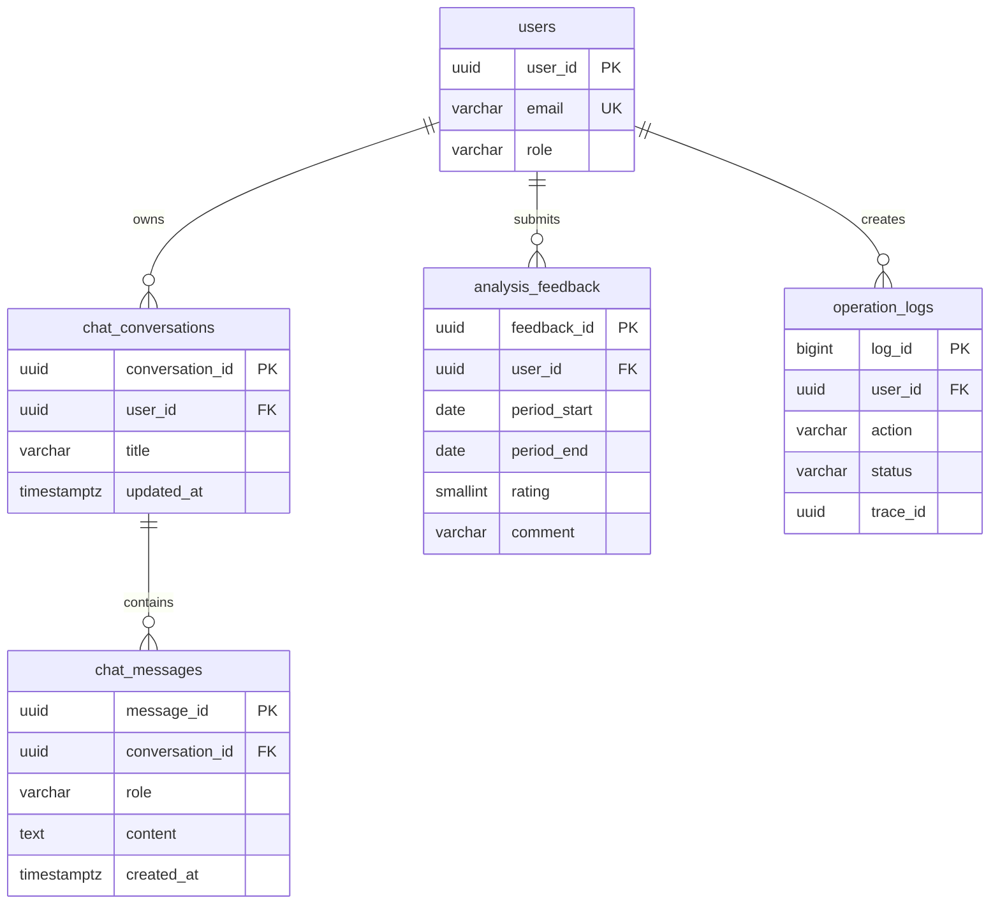

# 05-1｜데이터베이스 설계서 (SSE·멀티턴·AI 분석 평가 확장)

> **구현 동기화 기준(2026-08-11):** `backend/sql/06_chat_conversations.sql`, `07_analysis_feedback.sql`과 현재 서비스의 저장 규칙을 기준으로 확인했습니다.

## 1. 문서 범위

이 문서는 [05 SSE·멀티턴 AI 확장 계획서](./05_SSE_멀티턴_AI_확장_계획서.md)의 데이터베이스 상세 설계입니다.

기존 MVP의 `users`, `study_records`, `studies`, `study_members`, `operation_logs` 테이블은 유지하고 다음 기능을 추가합니다.

- Supabase에 저장하는 멀티턴 학습 코치 대화방·메시지
- AI 분석 결과에 대한 사용자 평점·의견
- 관리자 운영 로그 SSE를 위한 이벤트 식별 정보

이번 확장에서는 AI 분석 결과 자체를 별도 테이블에 저장하지 않습니다. 평가는 `user_id + period_start + period_end` 조합으로 분석 대상을 식별합니다.

## 2. 관계 구조



## 3. 신규 테이블 상세

### 3.1 `chat_conversations`

| 컬럼 | 타입 | NULL | 제약조건·용도 |
| --- | --- | --- | --- |
| `conversation_id` | UUID | N | PK, `gen_random_uuid()` |
| `user_id` | UUID | N | `users.user_id` FK, 대화 소유자 |
| `title` | VARCHAR(100) | N | 기본값 `새 학습 코치 대화` 또는 첫 질문 기반 제목 |
| `created_at` | TIMESTAMPTZ | N | 생성 시각 |
| `updated_at` | TIMESTAMPTZ | N | 메시지 추가 시 갱신 |

권한 규칙:

- 사용자는 자신의 `conversation_id`만 조회·삭제할 수 있습니다.
- 존재하지 않거나 다른 사용자의 대화방은 API에서 동일하게 `CONVERSATION_NOT_FOUND`로 처리합니다.
- 삭제 시 `chat_messages`도 함께 삭제합니다.

### 3.2 `chat_messages`

| 컬럼 | 타입 | NULL | 제약조건·용도 |
| --- | --- | --- | --- |
| `message_id` | UUID | N | PK, `gen_random_uuid()` |
| `conversation_id` | UUID | N | `chat_conversations.conversation_id` FK `ON DELETE CASCADE` |
| `role` | VARCHAR(10) | N | `user` 또는 `model` |
| `content` | TEXT | N | 질문·답변 본문 |
| `created_at` | TIMESTAMPTZ | N | 메시지 생성 시각 |
| `input_tokens` | INTEGER | Y | SDK가 제공할 때만 저장, 0 이상 |
| `output_tokens` | INTEGER | Y | SDK가 제공할 때만 저장, 0 이상 |

메시지 순서는 `created_at ASC, message_id ASC`로 고정합니다. Gemini에는 최근 N개 메시지만 전달하고, 전체 이력은 DB에 보관합니다.

### 3.3 `analysis_feedback`

| 컬럼 | 타입 | NULL | 제약조건·용도 |
| --- | --- | --- | --- |
| `feedback_id` | UUID | N | PK, `gen_random_uuid()` |
| `user_id` | UUID | N | `users.user_id` FK |
| `period_start` | DATE | N | 평가 대상 분석 시작일 |
| `period_end` | DATE | N | 평가 대상 분석 종료일 |
| `rating` | SMALLINT | N | 1~5점 CHECK |
| `comment` | VARCHAR(1000) | Y | 선택 의견 |
| `created_at` | TIMESTAMPTZ | N | 최초 평가 시각 |
| `updated_at` | TIMESTAMPTZ | N | 평가 수정 시각 |

제약조건:

- `period_start <= period_end`
- `rating BETWEEN 1 AND 5`
- `UNIQUE(user_id, period_start, period_end)`
- 사용자가 같은 기간을 다시 평가하면 새 행을 만들지 않고 기존 행을 수정합니다.

## 4. 구현 DDL

`backend/sql/06_chat_conversations.sql`:

```sql
create table if not exists public.chat_conversations (
    conversation_id uuid primary key default gen_random_uuid(),
    user_id uuid not null references public.users(user_id),
    title varchar(100) not null default '새 학습 코치 대화',
    created_at timestamptz not null default now(),
    updated_at timestamptz not null default now()
);

create table if not exists public.chat_messages (
    message_id uuid primary key default gen_random_uuid(),
    conversation_id uuid not null references public.chat_conversations(conversation_id) on delete cascade,
    role varchar(10) not null check (role in ('user', 'model')),
    content text not null,
    created_at timestamptz not null default now(),
    input_tokens integer check (input_tokens is null or input_tokens >= 0),
    output_tokens integer check (output_tokens is null or output_tokens >= 0)
);

create index if not exists idx_chat_conversations_user_updated
    on public.chat_conversations(user_id, updated_at desc);
create index if not exists idx_chat_messages_conversation_created
    on public.chat_messages(conversation_id, created_at, message_id);
```

`backend/sql/07_analysis_feedback.sql`:

```sql
create table if not exists public.analysis_feedback (
    feedback_id uuid primary key default gen_random_uuid(),
    user_id uuid not null references public.users(user_id),
    period_start date not null,
    period_end date not null,
    rating smallint not null check (rating between 1 and 5),
    comment varchar(1000),
    created_at timestamptz not null default now(),
    updated_at timestamptz not null default now(),
    unique (user_id, period_start, period_end),
    check (period_start <= period_end)
);

create index if not exists idx_analysis_feedback_created
    on public.analysis_feedback(created_at desc);
create index if not exists idx_analysis_feedback_rating
    on public.analysis_feedback(rating);
```

## 5. 운영 로그·SSE 저장 규칙

SSE 이벤트를 별도 DB 테이블에 저장하지 않습니다. `operation_logs`가 원본이며 Redis는 실시간 전달용입니다.

| 동작 | `operation_logs.action` | SSE event |
| --- | --- | --- |
| 채팅 질문·답변 성공 | `chat.message` | `admin.log.updated` |
| 채팅 오류 | `chat.message` | `admin.log.updated` |
| 분석 평가 저장·수정 성공 | `analysis.feedback.submit` | `admin.log.updated` |
| 분석 평가 오류 | `analysis.feedback.submit` | `admin.log.updated` |

로그·SSE에는 비밀번호, API 키, 전체 Gemini 프롬프트, 전체 대화 본문, 평가 의견 전문을 넣지 않습니다.

## 6. 마이그레이션·검증 순서

1. 기존 5개 MVP 테이블 존재 여부 확인
2. `06_chat_conversations.sql` 실행
3. `07_analysis_feedback.sql` 실행
4. FK·CHECK·UNIQUE 제약조건 검증
5. 샘플 대화 생성 후 메시지 cascade 삭제 확인
6. 동일 사용자·동일 기간 중복 평가가 UPDATE로 처리되는지 확인
7. 관리자 조회용 인덱스가 사용되는지 확인

운영 배포 전에는 기존 데이터를 삭제하지 않는지, 신규 테이블 생성이 재실행에 안전한지 확인합니다.

## 7. 향후 확장 후보

분석 결과를 장기간 보존하거나 동일 기간에 여러 번 분석할 필요가 생기면 `analysis_runs` 테이블을 추가하고 `analysis_feedback.analysis_id` FK로 변경합니다. 현재 범위에서는 기간 기반 평가로 충분하므로 별도 분석 결과 테이블을 만들지 않습니다.
