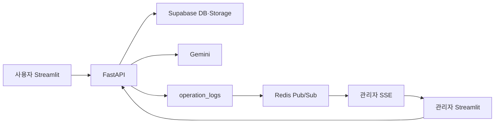

# 6단계｜구현과 계획의 일치 분석

## 1. 문서 목적

이 문서는 프로젝트 계획 문서 1~4에 정의된 MVP와 5번 확장 계획에 정의된 SSE·멀티턴 AI·AI 분석 평가·그룹 운영 보완이 현재 코드에 어떻게 반영되었는지 분석합니다.

판정은 문서 번호의 개발 순서를 따릅니다. 1~4번은 MVP 당시 기준이고, 5번 계열은 이후 추가·변경된 최종 기준입니다. 두 단계가 충돌하면 5번 계열과 그 안의 팀 최종 결정을 우선합니다.

분석 대상은 다음과 같습니다.

- `01_문제와_사용_시나리오_정의.md`
- `02_통합_아키텍처_설계.md`
- `03_데이터베이스_설계서_MVP.md`
- `03_API_명세서_MVP.md`
- `03_화면_설계서_MVP.md`
- `04_개발_계획서_MVP.md`
- `05_SSE_멀티턴_AI_확장_계획서.md`
- `05-1_데이터베이스_설계서_확장.md`
- `05-2_API_명세서_확장.md`
- `05-3_화면_설계서_확장.md`
- 현재 `backend`, `frontend_user`, `frontend_admin` 구현

분석 기준일은 2026년 8월 11일이며, `fin` 브랜치의 현재 작업 트리를 기준으로 확인했습니다.

## 2. 판정 기준

| 판정 | 의미 |
| --- | --- |
| 일치 | 계획의 기능·구조·계약이 현재 구현에 반영됨 |
| 부분 일치 | 핵심 기능은 구현되었으나 세부 동작·화면·주기가 계획과 다름 |
| 추가 구현 | 계획 범위를 넘어 현재 코드에 추가된 기능 |
| 문서 갱신 필요 | 구현은 완료되었지만 계획서·README·체크리스트가 이전 상태를 설명함 |
| 확인 필요 | 코드와 자동 테스트만으로 실제 외부 환경의 동작을 확정할 수 없음 |

## 3. 종합 결론

현재 구현은 계획서 1~4의 MVP 기능과 5번 계획의 핵심 확장 기능을 반영하고 있습니다.

- MVP의 인증, 개인 학습 기록, 통계, 이미지 업로드, 그룹 스터디, AI 분석, 운영 로그와 관리자 화면이 구현되어 있습니다.
- 확장 범위의 Redis Pub/Sub 기반 관리자 SSE, Gemini 멀티턴 학습 코치, AI 분석 사용자 평가와 관리자 평가 조회가 구현되어 있습니다.
- 선택 기능으로 분류된 채팅 답변 토큰 스트리밍은 구현하지 않았습니다. 이는 필수 완료 범위의 누락이 아닙니다.
- 백엔드 자동 테스트는 보강 후 `63 passed, 1 warning`으로 통과했습니다.
- 백엔드와 두 프론트엔드의 Python 구문 컴파일은 모두 통과했습니다.

핵심 기능 구현은 최종 계획과 일치하며, 다음 항목만 보완 또는 외부 확인이 필요합니다.

1. 관리자 SSE 연결 상태 문구가 실제 연결·재연결 상태를 충분히 구분하지 못합니다.
2. 백엔드 서비스 자동 테스트는 보강했으며, Streamlit 상태 유지와 배포 환경 통합 동작은 수동 확인이 필요합니다.
3. 백엔드 README와 테스트 체크리스트는 현재 구현과 `63 passed` 결과로 갱신했습니다. 루트 README는 발표 구성 확정 후 별도로 수정합니다.
4. 배포 환경의 실제 Supabase·Redis·Gemini 통합 동작은 저장소만으로 확인할 수 없습니다.

## 4. 계획서 1｜문제와 사용 시나리오

### 4.1 요구사항과 구현 매핑

| 계획 시나리오 | 현재 구현 | 판정 |
| --- | --- | --- |
| 개인 학습 기록 등록·수정·삭제 | `study_records`와 기록 API, 사용자 기록 화면 구현 | 일치 |
| 과목별·누적 학습 시간 확인 | `/records/stats`와 사용자 메인 화면 구현 | 일치 |
| 그룹 스터디 검색·생성·참여·탈퇴 | 스터디 API와 목록·입력·상세 화면 구현 | 일치 |
| 저장된 기록 기반 AI 학습 분석 | `/analyses`와 AI 분석 화면 구현 | 일치 |
| 관리자 학습·스터디·오류 현황 확인 | `/admin/dashboard`, `/admin/logs`와 관리자 화면 구현 | 일치 |
| AI 분석 품질 관리 | 5번 확장의 사용자 평가와 관리자 평가 화면 구현 | 일치 |
| 정상·빈 데이터·API 오류 처리 | 주요 화면에 안내·재시도·빈 상태 구현 | 일치 |

### 4.2 분석

초기 문제 정의에서 우선 구현 대상으로 정한 개인 기록, 그룹 모집, AI 분석은 모두 실제 기능으로 연결되었습니다. 관리자 운영 시나리오도 운영 로그와 대시보드로 구현되었습니다.

AI 분석 품질 관리는 초기 문서에서 후보 기능이었으나 5번 계획을 통해 정식 확장 범위가 되었고, 현재 `analysis_feedback` 저장과 관리자 조회 화면까지 구현되었습니다.

## 5. 계획서 2｜통합 아키텍처

### 5.1 구조 일치 여부

| 설계 요소 | 현재 구현 | 판정 |
| --- | --- | --- |
| 사용자 Streamlit 앱 분리 | `frontend_user` 별도 앱 | 일치 |
| 관리자 Streamlit 앱 분리 | `frontend_admin` 별도 앱 | 일치 |
| 공통 FastAPI 백엔드 | `backend/app/main.py`에 전체 router 등록 | 일치 |
| Supabase 데이터 저장 | service 계층에서 Supabase client 사용 | 일치 |
| Gemini 분석 | 단일 분석과 멀티턴 호출 구현 | 일치 |
| 운영 로그 공통 저장 | `operation_logs`, `log_utils.py` 사용 | 일치 |
| 사용자 자동 갱신 | 5번 최종 결정에 따라 그룹 목록·상세 120초 조회 구현 | 일치 |
| 관리자 실시간 확장 | Redis Pub/Sub과 SSE 구현 | 일치 |
| 환경변수 분리 | `.env.example`에 Supabase·Gemini·Redis·백엔드 URL 정의 | 일치 |

### 5.2 현재 요청 흐름



현재 구조는 기존 HTTP 요청 흐름을 유지하면서 관리자 화면에만 SSE를 추가한다는 확장 원칙을 따릅니다. Redis 장애가 원래의 기록·분석·평가 처리 결과를 실패로 바꾸지 않도록 이벤트 발행 오류를 분리한 점도 계획과 일치합니다.

## 6. 계획서 3｜데이터베이스

### 6.1 MVP 테이블

| 테이블 | 기능 | 구현 파일 | 판정 |
| --- | --- | --- | --- |
| `users` | 사용자·관리자 구분 | `backend/sql/01_users.sql` | 일치 |
| `study_records` | 개인 학습 기록·인증 이미지 경로 | `backend/sql/02_study_records.sql` | 일치 |
| `studies` | 그룹 스터디 모집 정보 | `backend/sql/03_studies.sql` | 일치 |
| `study_members` | 그룹 참여 관계 | `backend/sql/04_study_members.sql` | 일치 |
| `operation_logs` | 기능 성공·실패·추적 ID·처리시간 | `backend/sql/05_operation_logs.sql` | 일치 |

### 6.2 확장 테이블

| 테이블 | 주요 제약조건 | 판정 |
| --- | --- | --- |
| `chat_conversations` | 사용자 FK, 최근 수정 시각 인덱스 | 일치 |
| `chat_messages` | 대화방 FK, `ON DELETE CASCADE`, role CHECK | 일치 |
| `analysis_feedback` | 평점 CHECK, 기간 CHECK, 사용자·기간 UNIQUE | 일치 |

`analysis_feedback`은 `user_id + period_start + period_end` 충돌 키를 이용한 upsert로 동일 기간의 중복 평가를 한 행으로 유지합니다. 대화방 삭제 시 메시지를 함께 삭제하도록 FK cascade도 반영되어 있습니다.

SSE 이벤트는 별도 테이블에 저장하지 않고 `operation_logs`를 원본으로 사용하며 Redis는 전달 수단으로만 사용하는 설계와 구현이 일치합니다.

## 7. 계획서 3｜API

### 7.1 MVP API

| 영역 | 주요 API | 판정 |
| --- | --- | --- |
| Auth | `/auth/signup`, `/auth/login`, `/auth/logout` | 일치 |
| Records | `/records`, `/records/stats`, `/records/{record_id}` | 일치 |
| Uploads | `/uploads/proof-image` | 일치 |
| Studies | `/studies`, `/studies/{study_id}`, 참여·탈퇴 API | 일치 |
| AI Analysis | `POST /analyses` | 일치 |
| Admin | `/admin/dashboard`, `/admin/logs` | 일치 |

현재 구현의 `DELETE /studies/{study_id}` 계약은 원본 `05-2_API_명세서_확장.md`에 요청값, 소유자 검증, 성공 응답, 실패 응답과 함께 반영했습니다.

### 7.2 확장 API

| 영역 | API | 판정 |
| --- | --- | --- |
| SSE | `GET /events/stream` | 일치 |
| 대화방 | `POST/GET /chat/conversations` | 일치 |
| 메시지 | `GET/POST /chat/conversations/{id}/messages` | 일치 |
| 대화방 삭제 | `DELETE /chat/conversations/{id}` | 일치 |
| 사용자 평가 | `GET/POST /analyses/feedback` | 일치 |
| 관리자 평가 | `GET /admin/analysis-feedback` | 일치 |

확장 API의 사용자 소유권 확인, 관리자 권한 확인, 최근 20개 메시지 제한, Gemini 오류 코드, 운영 로그 action이 코드에 반영되어 있습니다.

### 7.3 공통 오류와 추적

- 백엔드 middleware가 요청별 `trace_id`를 생성하고 `X-Trace-Id` 헤더를 반환합니다.
- HTTP 예외와 입력 검증 오류는 공통 오류 응답으로 변환됩니다.
- 주요 확장 API의 입력 검증 실패도 운영 로그에 기록합니다.
- 프론트엔드 공통 API client가 오류 코드·메시지·trace ID를 읽어 화면에 전달합니다.

## 8. 계획서 3｜화면

### 8.1 MVP 화면

| 화면 | 구현 상태 | 판정 |
| --- | --- | --- |
| 로그인·회원가입 | 별도 페이지와 세션 상태 구현 | 일치 |
| 메인·학습 통계 | KPI·기록·빈 상태 구현 | 일치 |
| 개인 학습 목록·입력·상세 | CRUD·이미지·오류 처리 구현 | 일치 |
| 그룹 목록·입력·상세 | 검색·생성·참여·탈퇴·수정·삭제, 120초 갱신 구현 | 일치 |
| AI 학습 분석 | 기간 선택·결과·오류·재시도 구현 | 일치 |
| 마이페이지 | 주요 메뉴에서 분리해 사용자 이름·역할 아래, 로그아웃 위에 이동 버튼 배치; 페이지에서 사용자 정보·로그아웃 구현 | 일치 |
| 관리자 대시보드·운영 로그 | KPI·필터·상세·trace ID 구현 | 일치 |

그룹 스터디 목록과 상세는 팀에서 확정한 120초 간격으로 자동 조회합니다. 이 결정은 원본 5번 확장 계획과 `05-3_화면_설계서_확장.md`에 반영했습니다.

### 8.2 확장 화면

| 요구사항 | 현재 구현 | 판정 |
| --- | --- | --- |
| AI 분석 결과 아래 평가 | 평점·의견 저장·수정·복원 구현 | 일치 |
| 일반 학습 코치 | 대화방 생성·선택·삭제, 메시지 이력·질문 구현 | 일치 |
| AI 분석과 채팅 두 탭 배치 | 두 개의 탭으로 구현 | 일치 |
| 관리자 운영 로그 SSE 갱신 | 이벤트 큐 확인 후 관련 API 재조회 | 일치 |
| 관리자 평가 목록·통계 | 필터·평균·분포·목록 구현 | 일치 |
| SSE 연결 상태 표시 | 화면 표시가 실제 연결 상태를 완전히 구분하지 못함 | 부분 일치 |

현재 탭 구조는 작은 화면에서 콘텐츠 폭을 확보하고 AI 분석과 채팅의 작업 문맥을 분리합니다. 합의된 탭 방식은 원본 5번 확장 계획과 `05-3_화면_설계서_확장.md`에 반영했습니다.

### 8.3 관리자 평가 오류 처리

`frontend_admin/app_pages/03_analysis_feedback.py`는 실제 평가 API 호출이 실패하면 계획서의 공통 예외 처리 원칙에 따라 다음 정보를 표시합니다.

- 백엔드 오류 메시지
- 오류 코드
- trace ID
- 수동 `다시 시도` 버튼

이전의 `DEMO_FEEDBACK` 자동 대체는 제거했습니다. 따라서 API 장애가 실제 평가 지표로 오인되지 않으며, 사용자가 명시적으로 재시도할 수 있습니다.

### 8.4 SSE 연결 상태 문제

관리자 대시보드와 운영 로그는 실제 연결 결과와 관계없이 `SSE 연결` 문구를 표시합니다. 관리자 평가 화면은 SSE listener thread의 생존 여부로 연결 상태를 판단하지만, 해당 스레드는 연결 실패 후 재시도 중에도 살아 있습니다.

확장 계획의 `연결 중`, `연결됨`, `재연결 중`, `연결 실패` 상태를 충족하려면 `AdminEventListener`가 현재 연결 상태와 마지막 오류를 별도로 저장하고 화면이 해당 값을 표시해야 합니다.

## 9. 계획서 4｜구현 구조·협업·테스트

### 9.1 파일 구조

| 구조 원칙 | 현재 구현 | 판정 |
| --- | --- | --- |
| 백엔드 `router → service → Supabase` | 기능별 router·schema·service 분리 | 일치 |
| 프론트엔드 `page → client → core` | 사용자·관리자 앱 모두 분리 | 일치 |
| 사용자·관리자 앱 분리 | 별도 실행 앱 구성 | 일치 |
| router 중앙 등록 | `backend/app/main.py`에 전체 router 등록 | 일치 |
| 페이지 중앙 등록 | 두 앱의 `app.py`에 페이지 등록 | 일치 |
| 환경변수·비밀값 분리 | `.env.example`, `.gitignore` 적용 | 일치 |

### 9.2 자동 검증 결과

2026년 8월 11일 현재 확인 결과는 다음과 같습니다.

```text
Backend pytest: 63 passed, 1 warning
Backend compile: passed
User frontend compile: passed
Admin frontend compile: passed
```

경고는 FastAPI TestClient가 사용하는 Starlette·httpx 호환성 deprecation 경고이며 현재 테스트 실패는 아닙니다.

### 9.3 테스트 보강 결과

5번 계획의 핵심 서비스 규칙을 직접 검증하도록 테스트를 보강했습니다.

| 완료 기준 | 검증 결과 | 테스트 |
| --- | --- | --- |
| 두 번째 질문에 이전 문맥 포함 | 통과 | user/model 이력을 Gemini에 시간순 전달 |
| 최근 메시지 제한 | 통과 | 최근 20개만 조회·전달하고 순서 복원 |
| 타인 대화방 차단 | 통과 | 소유자가 아니면 404 반환 |
| Gemini 429·503·500 | 통과 | 서비스 예외별 상태·코드 매핑 |
| 평가 중복 수정 | 통과 | 사용자·기간 충돌 키 upsert |
| 로그 이후 Redis publish | 통과 | 로그 insert 성공 뒤 이벤트 발행 |
| Redis 장애 시 원래 요청 유지 | 통과 | publish 예외를 격리하고 로그 저장 결과 유지 |
| SSE 필터 유지 재조회 | 수동 확인 필요 | 실제 Streamlit·배포 환경 통합 시나리오 |

`docs/test_checklist.md`에는 보강 항목과 전체 `63 passed, 1 warning` 결과를 추가했습니다.

### 9.4 조회 성능 최적화

현재 구현에는 API·DB 스키마·프론트엔드 계약을 변경하지 않는 두 가지 최적화가 반영되어 있습니다.

| 최적화 | 적용 내용 | 검증 |
| --- | --- | --- |
| Supabase 클라이언트 재사용 | `get_supabase()` 결과를 애플리케이션 단위로 캐시 | 두 번 호출해도 한 번만 생성하는 테스트 추가 |
| 그룹 스터디 목록 일괄 조회 | 스터디별 owner·참여자 수·가입 여부 개별 조회를 `studies`, `study_members`, `users` 3회 일괄 조회로 변경 | 두 스터디 응답을 3회 조회로 조립하는 테스트 추가 |

그룹 스터디 목록 API의 URL·요청·응답 모델은 변경하지 않았습니다. 스터디가 없으면 `studies` 조회 한 번으로 종료하고, 스터디 수가 증가해도 관련 데이터 조회 횟수는 기본 3회를 유지합니다.

## 10. 계획서 5｜확장 기능 완료 여부

### 10.1 SSE

| 완료 기준 | 판정 |
| --- | --- |
| `text/event-stream` 응답 | 완료 |
| `Cache-Control`, `X-Accel-Buffering` 헤더 | 완료 |
| `admin.log.updated` JSON 이벤트 | 완료 |
| 20초 keep-alive | 완료 |
| 관리자 권한 확인 | 완료 |
| Redis 장애가 업무 결과에 영향 없음 | 서비스 테스트 완료, 배포 통합 확인 필요 |
| 사용자 화면에서 SSE 미사용 | 완료 |
| 연결 상태 UI | 부분 완료 |

### 10.2 멀티턴 학습 코치

| 완료 기준 | 판정 |
| --- | --- |
| 사용자별 대화방 저장 | 완료 |
| 메시지 시간순 조회 | 완료 |
| 최근 20개 문맥 전달 | 완료, 서비스 테스트 통과 |
| `user`·`model` 역할 변환 | 완료 |
| 대화방 cascade 삭제 | 완료 |
| 404·429·503·500 처리 | 완료, 서비스 테스트 통과 |
| 질문·답변 운영 로그 | 완료 |
| 화면 생성·선택·삭제·질문 | 완료 |
| 답변 토큰 스트리밍 | 미구현, 선택 범위 |

### 10.3 AI 분석 평가

| 완료 기준 | 판정 |
| --- | --- |
| 1~5점과 선택 의견 저장 | 완료 |
| 동일 기간 평가 수정 | 완료 |
| 기존 평가 복원 | 완료 |
| 관리자 목록·평균 평점·의견 | 완료 |
| 평점·날짜 필터 | 완료 |
| 운영 로그와 SSE 갱신 | 완료 |
| API 오류 화면 | 완료 |

## 11. 문서와 구현의 불일치 목록

| 우선순위 | 불일치 | 권장 조치 |
| --- | --- | --- |
| 완료 | 루트 README가 MVP와 확장 기능을 충분히 설명하지 않음 | 발표·프로젝트 대문 역할에 맞게 아키텍처·설계·구현·검증 흐름으로 전면 갱신 |
| 완료 | 그룹 자동 갱신 120초 합의 | 원본 5번 확장 계획·화면 설계에 반영 |
| 완료 | AI 분석·채팅 두 탭 합의 | 원본 5번 확장 계획·화면 설계에 반영 |
| 중간 | SSE 연결 상태가 실제 상태와 다를 수 있음 | listener 상태 모델 추가 |
| 완료 | 확장 핵심 서비스 테스트 부족 | 자동 테스트 보강, 전체 63 passed |
| 중간 | 배포 검증 기록과 URL 없음 | 배포 URL·환경·시연 결과 기록 |
| 완료 | 스터디 삭제 API가 MVP 명세에 없음 | 원본 5번 확장 API·화면 설계에 계약 추가 |
| 완료 | 백엔드 README가 SQL 06·07과 Redis를 누락 | 실행·마이그레이션 순서 갱신 |
| 완료 | 테스트 체크리스트가 35 passed 상태 | 63 passed 결과와 보강 범위 추가 |
| 완료 | 사이드바 마이페이지가 주요 기능 메뉴에 함께 표시됨 | 사용자 계정 영역으로 분리하고 원본 5번 확장 계획·화면 설계에 최종 배치 반영 |

## 12. 발표 전 최종 검증 시나리오

계획과 구현의 일치를 가장 짧게 증명하는 시나리오는 다음과 같습니다.

1. 사용자 로그인
2. 학습 기록 등록
3. 메인 통계 반영 확인
4. 저장된 기록으로 AI 분석 실행
5. AI 분석 평점과 의견 저장
6. 동일 기간 평가 수정 후 중복 행이 생기지 않는지 확인
7. 학습 코치 대화방 생성
8. 첫 질문과 후속 질문으로 멀티턴 문맥 확인
9. 관리자 화면에서 SSE 연결 상태 확인
10. 새 평가와 `analysis.feedback.submit` 로그 자동 반영 확인
11. 운영 로그에서 action·status·latency·trace ID 확인
12. Redis를 사용할 수 없는 경우에도 사용자 데이터 저장이 유지되고 관리자 화면에 재연결 상태가 표시되는지 확인

## 13. 최종 판정

현재 프로젝트는 계획서 1~4의 MVP를 구현한 뒤 5번 계획에 따라 SSE, 멀티턴 학습 코치, AI 분석 평가와 사용자 사이드바 동선을 확장·개선했다는 개발 흐름과 일치합니다.

기술적 핵심 구조와 API는 최종 계획대로 구현되었고, 원본 5번 계열도 현재 구현과 합의 사항에 동기화했습니다. 남은 작업은 다음 두 가지입니다.

1. 관리자 SSE 연결·재연결 상태 표시 세분화
2. 외부 서비스가 연결된 배포 환경에서 완료 기준 통합 검증

위 항목을 정리하면 발표에서 “문제 정의 → 설계 → MVP 구현 → 확장 → 검증”의 흐름과 설계 문서·실제 구현의 일치를 명확하게 제시할 수 있습니다.
