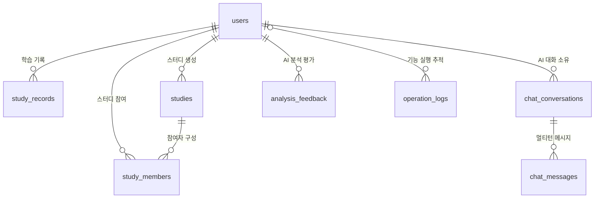

# 발표용｜통합 데이터베이스 설계

[README로 돌아가기](../../README.md) · [상세 MVP 설계](../03_데이터베이스_설계서_MVP.md) · [상세 확장 설계](../05-1_데이터베이스_설계서_확장.md)

## 1. 최종 테이블 관계

## 2. 테이블과 기능의 연결

| 테이블 | 연결 기능 |
| --- | --- |
| `users` | 로그인 사용자·관리자 역할과 사용자 데이터의 기준 |
| `study_records` | 학습 기록 CRUD·통계와 Gemini AI 분석의 입력 |
| `studies`, `study_members` | 그룹 스터디·참여·소유권과 다대다 참여 관계 |
| `chat_conversations`, `chat_messages` | AI 코치 대화방·멀티턴 이력과 문맥 순서 유지 |
| `analysis_feedback` | 사용자·분석 기간별 평점·의견과 관리자 통계 |
| `operation_logs` | 성공·실패·지연 시간·`trace_id` 기반 요청 추적 |

## 3. 데이터 정합성 규칙

- PK·FK로 사용자, 스터디, 대화의 관계를 보장합니다.
- `study_members`는 같은 사용자와 스터디의 중복 참여를 제한합니다.
- `analysis_feedback`은 `UNIQUE(user_id, period_start, period_end)`로 동일 기간 평가를 중복 생성하지 않고 갱신합니다.
- 평점은 `CHECK` 제약으로 1~5 범위만 허용합니다.
- 대화방 삭제 시 소속 메시지는 FK Cascade로 함께 삭제합니다.
- `operation_logs.trace_id`는 API 오류 응답의 `trace_id`와 연결되어 같은 요청을 추적합니다.
