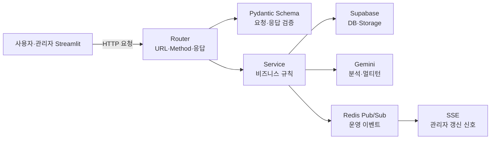

# 발표용｜통합 API 설계

[README로 돌아가기](../../README.md) · [상세 MVP 명세](../03_API_명세서_MVP.md) · [상세 확장 명세](../05-2_API_명세서_확장.md)

## 1. API 처리 구조



- Router는 HTTP 계약과 상태 코드를 담당합니다.
- Schema는 필수값·타입·길이·범위를 검증합니다.
- Service는 소유권·중복·정원·AI 호출 등 기능 규칙을 담당합니다.
- 외부 서비스 오류도 공통 API 오류 형식으로 변환합니다.

## 2. 대표 API와 기능 연결

| API 영역 | 대표 API | 연결 기능 |
| --- | --- | --- |
| Auth | `POST /auth/login` | 로그인 정보와 화면 역할 연결 |
| Records | `POST /records`, `GET /records/stats` | 학습 등록·통계·AI 분석 데이터 생성 |
| Studies | `GET/POST /studies`, `POST /studies/{study_id}/join` | 스터디 탐색·생성·참여 |
| Analyses | `POST /analyses` | 저장된 학습 기록을 Gemini로 분석 |
| Chat | `POST /chat/conversations/{conversation_id}/messages` | 이전 메시지를 포함한 멀티턴 질문 |
| Feedback | `GET/POST /analyses/feedback` | 사용자 평가 조회·저장·수정 |
| Admin | `GET /admin/dashboard`, `/admin/logs`, `/admin/analysis-feedback` | 운영 지표·로그 추적·AI 평가 분석 |
| Events | `GET /events/stream` | Redis 이벤트를 관리자 화면에 SSE로 전달 |

## 3. 표준 오류와 요청 추적

```json
{
  "code": "ERROR_CODE",
  "message": "사용자에게 표시할 메시지",
  "details": {},
  "trace_id": "uuid"
}
```

- 모든 주요 오류는 `code`, `message`, `details`, `trace_id` 형식을 사용합니다.
- 응답의 `X-Trace-Id`와 `operation_logs.trace_id`를 연결합니다.
- 사용자가 본 오류를 관리자가 같은 `trace_id`로 검색할 수 있습니다.

## 4. SSE 기능 연결

```text
업무 API 실행
→ operation_logs 저장
→ Redis Pub/Sub 이벤트 발행
→ FastAPI SSE 스트림 수신
→ 관리자 공용 큐 저장
→ 활성 화면이 최대 5초마다 큐 확인
→ 관련 이벤트가 있을 때만 조회 API 재호출
```

SSE는 화면 데이터 전체가 아니라 갱신 신호만 전달합니다. 최신 데이터는 기존 조회 API로 다시 가져와 정합성을 유지합니다.
