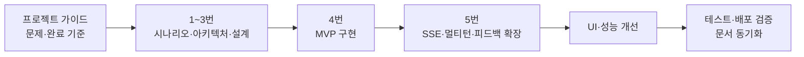

# 발표용｜MVP에서 최종 구현까지

[README로 돌아가기](../../README.md) · [MVP 구현 계획](../04_개발_계획서_MVP.md) · [확장 계획](../05_SSE_멀티턴_AI_확장_계획서.md) · [계획·구현 일치 분석](../etc/06_구현과_계획_일치_분석.md)

## 1. 개발 흐름



1. 가이드에 따라 문제·사용자 시나리오와 완료 기준을 먼저 정의했습니다.
2. DB·API·화면 설계 후 학습 기록·스터디·AI 분석 MVP를 구현했습니다.
3. MVP가 동작한 뒤 실시간 운영 로그, 멀티턴 AI와 사용자 평가를 확장했습니다.
4. 최종 합의와 실제 구현은 5번 계열 문서에 동기화했습니다.

## 2. 파일 구조

```text
.
├── backend/
│   ├── app/
│   │   ├── routers/       # HTTP 요청·응답과 API 경로
│   │   ├── schemas/       # Pydantic 요청·응답 모델
│   │   ├── services/      # 비즈니스 규칙·외부 서비스 연동
│   │   ├── core/          # Supabase·Gemini·Redis·로그 공통 설정
│   │   ├── exceptions/    # 표준 오류 처리
│   │   └── main.py        # FastAPI 시작점과 Router 등록
│   ├── sql/               # 테이블·제약조건·인덱스 DDL
│   └── tests/             # 백엔드 자동 테스트
├── frontend_user/
│   ├── app_pages/         # 사용자 기능 화면
│   ├── clients/           # 기능별 백엔드 API 호출
│   ├── core/              # 공통 HTTP·로그인 상태 처리
│   └── app.py             # 사용자 메뉴와 페이지 등록
├── frontend_admin/
│   ├── app_pages/         # 대시보드·운영 로그·AI 평가
│   ├── clients/           # 관리자 API·SSE 연결
│   ├── components/        # 관리자 공통 UI
│   ├── core/              # 공통 HTTP·권한 상태 처리
│   └── app.py             # 관리자 메뉴와 페이지 등록
└── docs/                  # 계획서·DB·API·화면 설계서
```

백엔드는 `Router → Schema·Service → Supabase·Gemini·Redis`, 프론트엔드는 `Page → Client → Core`로 역할을 분리했습니다.

## 3. 문제와 기술적 의사결정

| 필요 또는 문제 | 기술적 결정 | 결과 |
| --- | --- | --- |
| 핵심 사용자 흐름을 먼저 검증 | 학습 기록·스터디·단일 AI 분석 MVP | 작은 범위에서 UI–API–DB 통합 확인 |
| 서비스 실행 상태 관찰 | `operation_logs`, `trace_id` | 성공·실패·지연 시간과 요청 추적 |
| 관리자 반복 조회 감소 | Redis Pub/Sub + SSE | 이벤트 발생 시에만 관련 API 재조회 |
| AI 후속 질문 지원 | 대화방·메시지 저장과 최근 20개 문맥 | 멀티턴 학습 코치 구현 |
| AI 결과 평가 | 사용자·분석 기간별 피드백 upsert | 관리자 평균·분포·의견 조회 |
| 반복 클라이언트 생성 비용 | Supabase 클라이언트 재사용 | API 요청마다 클라이언트 객체를 다시 만드는 비용 감소 |
| 스터디별 반복 조회 | `studies`·`study_members`·`users` 일괄 조회 | 스터디 수와 무관하게 기본 3회 조회 |
| 기능 증가에 따른 탐색 복잡도 | AI 두 탭·그룹 영역·계정 영역 분리 | 기능 문맥과 사용자 동선 개선 |

## 4. 설계와 구현을 맞춘 방법

```text
문제·시나리오
→ DB 관계
→ API 계약
→ 화면 액션
→ 구현 파일
→ 자동·수동 검증
```

- 기존 1~4번 문서는 MVP 당시의 설계·개발 기록으로 보존했습니다.
- MVP 이후 변경은 5번 확장 계획·DB·API·화면 설계서에 최종 결정으로 반영했습니다.
- API 계약을 바꾸지 않고 Supabase 연결 재사용과 그룹 목록 조회를 최적화했습니다.
- 구현과 계획의 일치 여부는 별도 6번 분석 문서로 다시 검증했습니다.

## 5. 품질과 완성도

| 검증 | 결과 |
| --- | --- |
| 백엔드 전체 회귀 테스트 | `63 passed, 1 warning` |
| API 계약·표준 오류 | Router 테스트로 검증 |
| 멀티턴·피드백 | 최근 20개 이력·역할 순서·upsert·소유권 검증 |
| SSE | 헤더·이벤트 형식·Redis 장애 격리 검증 |
| 성능 개선 | 클라이언트 단일 생성·그룹 데이터 3회 조회 검증 |
| 배포 | 배포 환경에서 핵심 시나리오 검증 |

현재 알려진 제한사항도 숨기지 않고 관리합니다.

- 사용자 식별은 현재 MVP의 `user_id` 연결 방식을 사용하며 서버 세션·JWT는 후속 범위입니다.
- 관리자 SSE 상태 표시는 리스너 생존 여부와 실제 Redis 연결 상태를 완전히 구분하지 못합니다.
- 프론트엔드는 자동 테스트 없이 배포 환경 수동 체크리스트로 검증합니다.
- 사용자 피드백은 품질 개선 기반을 제공하며, 누적 후 프롬프트 개선 전후 비교가 필요합니다.
