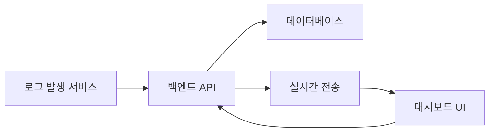
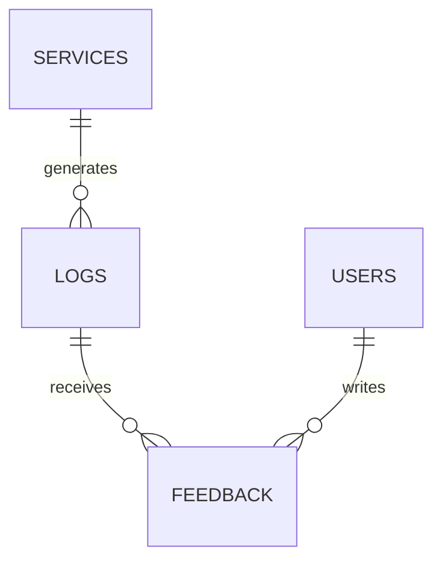

# 웹 서비스 기초 및 AI 백엔드 개발｜교과목 프로젝트 진행 가이드

<aside>
🎯

이 페이지는 **웹 서비스 기초 및 AI 백엔드 개발** 교과목의 단위프로젝트를 수행하는 훈련생용 가이드입니다.

</aside>

## 프로젝트 한눈에 보기

| 구분 | 내용 |
| --- | --- |
| 프로젝트 주제 | 실시간 로그 대시보드 인터페이스 |
| 핵심 목표 | 백엔드·DB·UI 통합, 실시간 로그 시각화, 사용자 피드백 기반 AI 답변 품질 및 서비스 최적화 |
| 필수 산출물 | API 설계 문서, 화면 설계서, 데이터베이스 설계서, 대시보드 구현 결과물 |
| 완료 상태 | 배포 환경에서 로그 수집·조회·시각화 핵심 기능을 시연할 수 있는 상태 |

## 프로젝트 발표 진행

- 발표 : 8월 12일(수) 5교시(14시 부터) 시작
- 발표 방법
    - Github read me 작성 내용 기반 발표 진행
    - 각 팀당 발표 시간 20분
    - 발표 순서
        - 4팀 → 2팀 → 3팀 → 1팀 → 5팀
    - 타임테이블
        - 14시 ~ 14시 25분 4팀
        - 14시 25분 ~ 14시 50분 2팀
        - 15시 ~ 15시 25분 3팀
        - 15시 25분 ~ 15시 50분 1팀
        - 16시 ~ 16시 25분 5팀
        - 16시 25분 ~ 16시 35분 쉬는시간
        - 16시 35분 ~ 17시 30분 교과목 평가
        - 17시 30분 ~ 17시 50분 시상 및 마무리
- 발표는 zoom 화면 공유를 통해 진행
    - zoom 링크 발표 당일 오전 전달
- 발표 영상은 녹화되어 포트폴리오 활용용으로 유투브 업로드 될 예정입니다.
- 단위 프로젝트 심사는 아래 각 항목으로 평가하며 강사/매니저 평가가 진행됩니다.
    - 평가항목
        - 서비스 기획 및 UI/UX 설계(25점)
        - 백엔드 및 데이터 구조 설계(25점)
        - 실제 작동 및 완성도(30점)
        - 발표 및 전달력(20점)
    - 평가 총점으로 각 팀의 순위발표가 진행됩니다.
    - 점수는 비공개이며 각 팀의 심사평은 취합하여 일괄 전달할 예정입니다.
    - 1,2위 팀에게는 시상이 진행됩니다.

## 1. 프로젝트 목표

1. 백엔드, 데이터베이스, 사용자 화면을 연결한 통합 아키텍처를 구현하고 배포합니다.
2. 실시간 데이터 스트리밍을 활용해 로그를 수집·조회·시각화하는 대시보드를 제작합니다.
3. 사용자 피드백 데이터를 수집하고 분석하여 AI 답변 품질과 서비스 성능을 개선합니다.

> 단순히 화면을 만드는 것이 아니라 **설계 문서와 실제 구현이 일치하고, 배포된 환경에서 핵심 기능이 동작하는 것**이 중요합니다.
> 

## 2. 권장 진행 순서

### 1단계｜문제와 사용 시나리오 정의

- 어떤 서비스의 로그를 수집할지 정합니다.
- 대시보드의 주요 사용자와 핵심 정보를 정의합니다.
- 정상·빈 데이터·권한 오류·API 오류 상황을 함께 정의합니다.

**예시 시나리오**

> 운영 담당자는 AI 서비스의 요청량, 오류율, 평균 응답시간을 확인합니다. 오류가 증가하면 ERROR 로그만 필터링하고 상세 내용을 조회합니다. 사용자는 AI 답변에 점수와 의견을 남기며, 팀은 이 데이터를 활용해 답변 품질을 개선합니다.
> 

### 2단계｜통합 아키텍처 설계

- UI → 백엔드 API → 데이터베이스의 연결 구조를 그립니다.
- 로그가 생성되어 화면에 반영되는 흐름을 정합니다.
- 사용자 피드백이 저장되고 품질 개선에 활용되는 흐름을 정합니다.
- 배포 구성과 환경변수·인증정보 관리 방식을 정합니다.



### 3단계｜API·화면·DB 설계서 작성

- 구현 전에 초안을 작성합니다.
- 개발 중 설계가 바뀌면 문서도 즉시 수정합니다.
- 엔드포인트, 화면 액션, 테이블 관계가 서로 연결되는지 점검합니다.

### 4단계｜최소 기능 구현

1. 로그 생성 또는 수집
2. 데이터베이스 저장
3. 로그 목록 조회
4. 대시보드 실시간 반영
5. 조건별 필터와 상세 조회
6. 사용자 피드백 저장

### 5단계｜예외 처리 및 품질 개선

- 입력값 오류, 인증 오류, 조회 결과 없음, 서버 오류를 처리합니다.
- 로딩·빈 데이터·오류·재시도 상태를 화면에 표시합니다.
- 피드백 데이터를 이용해 개선 항목을 정하고, 개선 전후 결과를 비교합니다.

### 6단계｜배포·시험·산출물 정리

- 배포 환경에서 모든 핵심 기능을 다시 시험합니다.
- 설계서와 실제 구현이 일치하는지 확인합니다.
- 테스트 결과, 화면 캡처, 실행 영상 또는 GIF, 알려진 제한사항을 정리합니다.

---

## 3. 주요 산출물 작성 가이드 및 예시

<aside>
✏️

아래 서비스명·URL·기술·데이터 구조·수치는 **작성 형식을 보여주기 위한 예시**입니다. 형식의 제한을 두지 않으니 양식에 따른 제한을 두지 않습니다.

</aside>

# 산출물 1｜API 설계 문서

## 반드시 포함할 내용

- 리소스 중심의 일관된 엔드포인트 URL과 의미에 맞는 HTTP Method
- API별 요청·응답 모델, 필수·선택 필드, 타입 힌트, 예시값
- 중첩 JSON을 표현하는 nested Pydantic 모델
- HTTP Status Code, 에러 코드, 메시지, 상세 정보를 포함한 표준 에러 응답
- 4xx·5xx 예외 상황별 처리 규칙

## 작성 예시

### 문서 개요

- 서비스명: LogScope
- 목적: AI 서비스 실행 로그를 실시간 수집·조회하고 오류 현황을 시각화
- Base URL: `https://api.example.com/v1`
- 인증 방식: Bearer Token
- 데이터 형식: JSON
- API 버전: v1

### 엔드포인트 정의 예시

| 기능 | Method | URL | 설명 |
| --- | --- | --- | --- |
| 로그 목록 조회 | GET | /logs | 조건에 맞는 로그를 최신순으로 조회 |
| 로그 생성 | POST | /logs | 새 로그를 등록 |
| 로그 상세 조회 | GET | /logs/{log_id} | 특정 로그의 상세 내용을 조회 |
| 피드백 등록 | POST | /logs/{log_id}/feedback | AI 답변에 대한 사용자 평가를 등록 |

**로그 목록 조회 Query Parameter 예시**

- `level`: 선택, INFO·WARN·ERROR
- `service_id`: 선택, 서비스 식별자
- `start_at`, `end_at`: 선택, 조회 기간
- `page`: 선택, 기본값 1
- `size`: 선택, 기본값 20

**정상 응답 예시**

```json
{
  "items": [{
    "log_id": 1024,
    "service_id": "chat-agent",
    "level": "ERROR",
    "message": "LLM request timeout",
    "created_at": "2026-08-03T10:15:31+09:00"
  }],
  "page": 1,
  "size": 20,
  "total": 1
}
```

### Pydantic 모델 예시

```python
class LogMetadata(BaseModel):
    model_name: str | None = None
    latency_ms: int | None = Field(default=None, ge=0)

class LogCreateRequest(BaseModel):
    service_id: str = Field(..., examples=["chat-agent"])
    level: Literal["INFO", "WARN", "ERROR"]
    message: str = Field(..., min_length=1)
    trace_id: str | None = None
    metadata: LogMetadata | None = None
```

### 표준 에러 응답 예시

```json
{
  "error": {
    "code": "LOG_NOT_FOUND",
    "message": "요청한 로그를 찾을 수 없습니다.",
    "details": {"log_id": 9999},
    "trace_id": "tr_01HXYZ"
  }
}
```

- 400: 필수값 누락 또는 형식 오류
- 401: 인증 토큰 누락·만료
- 404: 대상 리소스 없음
- 409: 중복 데이터 또는 상태 충돌
- 429: 호출 한도 초과
- 500: 서버 내부 오류
- 503: 외부 서비스 일시 장애

---

# 산출물 2｜화면 설계서

## 반드시 포함할 내용

- 메인, 상세, 입력, 설정, 에러 화면의 와이어프레임
- 논리적인 정보 계층구조
- 버튼, 입력폼, 테이블, 차트의 통일된 디자인 시스템
- 클릭, 호버, 드래그, 스크롤, 필터, 새로고침 등 사용자 액션
- 액션별 상태 변화, API 호출, 성공·실패 피드백

## 작성 예시

### 정보구조

- 대시보드: 전체 요청량, 오류율, 평균 응답시간, 시간대별 로그 추이
- 로그 목록: 검색·필터, 로그 상세
- 서비스 설정: 수집 대상, 알림 임계값
- 오류 안내: 권한 오류, 데이터 없음, 서버 오류

### 메인 대시보드 화면 정의

- **사용자 목적:** 현재 서비스 상태와 오류 발생 여부를 빠르게 확인
- **KPI 카드:** 전체 요청, 오류 건수, 오류율, 평균 응답시간
- **차트:** 시간대별 요청량, 서비스별 오류 건수
- **로그 테이블:** 시각, 서비스, 레벨, 메시지
- **상세 영역:** trace ID, 요청·응답 정보, 오류 상세

| 사용자 액션 | 시스템 반응 | 피드백 |
| --- | --- | --- |
| 기간 필터 변경 | 조회 API 재호출 후 차트 갱신 | 로딩 표시, 조회 결과 건수 표시 |
| ERROR 행 클릭 | 상세 API 호출 후 패널 열기 | 선택 행 강조, 실패 시 재시도 제공 |
| 새로고침 클릭 | 최신 로그 재조회 | 완료 시각 표시 |
| 피드백 등록 | 피드백 API 호출 | 저장 완료 또는 검증 오류 표시 |

### 디자인 시스템 예시

- Primary: #2563EB / Success: #16A34A / Warning: #D97706 / Error: #DC2626
- 제목: 24px Bold / 본문: 14px Regular
- 카드 간격: 16px / 화면 좌우 여백: 24px
- 버튼 상태: Default·Hover·Disabled·Loading

---

# 산출물 3｜데이터베이스 설계서

## 반드시 포함할 내용

- 3정규화 기준의 테이블 설계와 정규화 근거
- 논리 ERD: 엔티티, 속성, 관계, 카디널리티
- 물리 ERD: 테이블명, 컬럼, PK·FK, 인덱스
- 컬럼별 데이터 타입, 길이, 제약조건, 기본값, 코멘트
- 논리 ERD와 물리 ERD의 일치 여부

## 작성 예시

### 핵심 엔티티 및 관계

- services: 로그를 발생시키는 서비스
- logs: 개별 실행 로그
- feedback: AI 답변에 대한 사용자 평가
- users: 대시보드 사용자
- 관계: services 1:N logs, logs 1:0..N feedback, users 1:N feedback



### 물리 테이블 예시

| 테이블 | 컬럼 | 타입 | 제약조건·설명 |
| --- | --- | --- | --- |
| services | service_id | UUID | PK, NOT NULL |
| services | name | VARCHAR(100) | UNIQUE, NOT NULL |
| logs | log_id | BIGINT | PK, Auto Increment |
| logs | service_id | UUID | FK → services.service_id, NOT NULL |
| logs | level | VARCHAR(10) | CHECK(INFO·WARN·ERROR), NOT NULL |
| logs | created_at | TIMESTAMP | INDEX, NOT NULL |
| feedback | score | SMALLINT | CHECK(score BETWEEN 1 AND 5), NOT NULL |

### 정규화 근거 예시

서비스 이름을 logs에 반복 저장하지 않고 services 테이블로 분리하여 서비스 정보 변경 시 전체 로그를 수정해야 하는 갱신 이상을 방지합니다. 사용자 정보와 피드백도 분리하여 사용자 속성의 중복 저장을 줄입니다.

### 인덱스 예시

- `idx_logs_service_created_at(service_id, created_at DESC)`
- `idx_logs_level_created_at(level, created_at DESC)`
- 선정 근거: 서비스·오류 레벨·기간 조건 조회가 주요 사용 패턴이기 때문

---

# 산출물 4｜대시보드 구현 결과물

## 완료 기준

- 배포 환경에서 실제로 동작해야 합니다.
- 로그 수집·조회·시각화 기능을 시연할 수 있어야 합니다.
- 주요 오류 및 빈 데이터 상태를 확인할 수 있어야 합니다.
- 사용자 피드백 저장과 활용 흐름을 설명할 수 있어야 합니다.

## 결과 정리 예시

### 실행 정보

- 배포 URL: 실제 URL 입력
- API 문서 URL: 실제 Swagger URL 입력
- 저장소 URL: 실제 URL 입력
- 테스트 계정: 운영 매니저 안내에 따라 제공
- 실행 환경: 예) FastAPI, PostgreSQL, React, Docker

### 구현 기능

- 실시간 로그 수집
- 기간·서비스·레벨별 조회
- 요청량·오류율·응답시간 시각화
- 로그 상세 조회
- 사용자 피드백 수집
- 로딩·빈 데이터·오류 상태 처리

### 시연 순서 예시

1. 정상 로그와 오류 로그를 생성합니다.
2. 대시보드에서 실시간 반영 여부를 확인합니다.
3. ERROR 필터를 적용합니다.
4. 로그 상세 정보를 확인합니다.
5. 사용자 피드백을 등록합니다.
6. 오류 상황에서 오류 UI와 재시도 동작을 확인합니다.

---